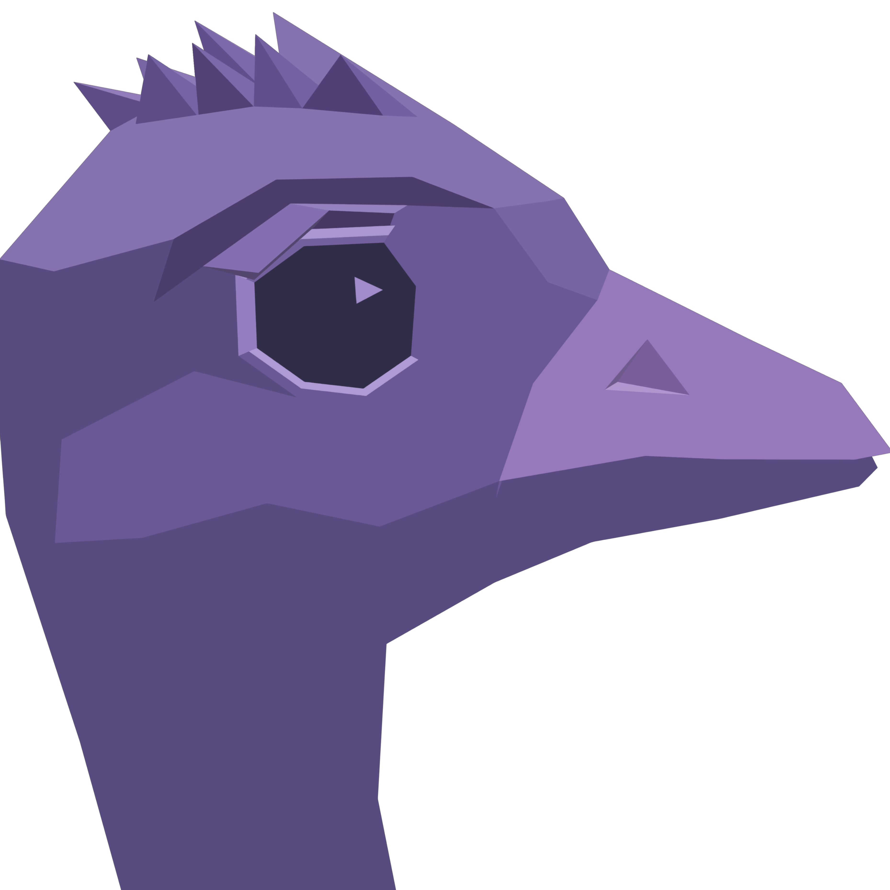
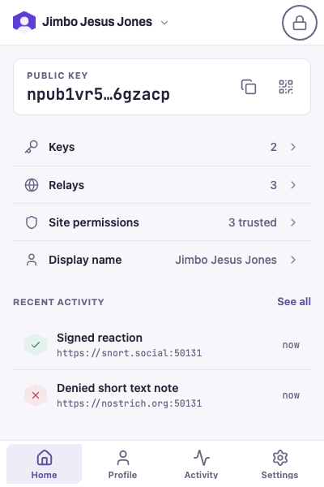

<p align="center">
  
</p>

<h1 align="center">Ostrilo</h1>

<p align="center">
  <strong>A Nostr signer extension for your browser.</strong><br>
  Use Nostr apps without handing your private key to each website.
</p>

<p align="center">

  <a href="https://github.com/macro88/ostrilo/actions/workflows/verify.yml"></a>  <a href="https://github.com/macro88/ostrilo/actions/workflows/e2e.yml"></a>  <a href="docs/TESTING.md"></a>  <a href="AGENTS.md#aislop-verification"></a>  <a href="AGENTS.md#react-doctor-verification"></a>  <a href="CHANGELOG.md"></a>  <a href="LICENSE"></a></p>

<p align="center">
  <a href="#install">Install</a> ·
  <a href="#get-started">Get started</a> ·
  <a href="#backup-and-recovery">Backup</a> ·
  <a href="#roadmap">Roadmap</a> ·
  <a href="#help">Help</a>
</p>

---

**Ostrilo is a Nostr signer extension that keeps your private keys in your
browser.** When a Nostr app needs a signature, it asks Ostrilo. You can see which
site is asking, check what it wants to sign, and approve or decline the request.

Keep several identities, switch between them, and set permissions for the sites
you use. Ostrilo also lets you edit your profile, choose your relays and review
your signing history.

<p align="center">
  <picture>
    <source media="(prefers-color-scheme: dark)" srcset="docs/design-review/screenshots/dark/23-popup-home-populated.png">
    
  </picture>
</p>

Ostrilo in light and dark themes. Screenshot from the
[September 2026 design review](docs/design-review/README.md), using sample data.

## Install

Browser-store releases are being prepared. Official installation links will be
added here when the listings are available.

Ostrilo has builds for Chromium browsers and Firefox. If you'd like to install
from source, follow [the build instructions](#build-from-source).

## Get started

1. **Add your identity.** Create a new key or import an existing Nostr private key
   (`nsec`), then choose a password for your vault.
2. **Keep a backup.** When creating your first key, save an encrypted backup or
   write the key down. Ostrilo asks you to check that you've recorded it before
   finishing setup. If you import a key, keep your existing backup.
3. **Connect to an app.** Open a Nostr website and choose its browser-extension
   sign-in option. Ostrilo will ask whether the site may see your public key.
4. **Review requests.** Check the site address, selected identity and event
   contents before approving a signature. Activity shows your signing history.

Use **Settings → Advanced Settings** to manage your keys, site permissions,
relays and password. You can lock the vault yourself or choose how long it waits
before locking automatically.

## Trust and control

Private keys are encrypted on your device. Ostrilo signs inside the extension
and returns the signed event to the website. The website never receives your
private key.

You choose which sites may see your public key. Signing an event also shares
that key, because it's part of the event. A site's permission applies to scripts
running on that page too.

For sites you trust, you can allow some actions without a prompt each time.
Text notes, deletion requests, zap requests and relay or HTTP login requests
always need approval. The [signing rules](src/domain/policy/trust-definitions.ts)
list the exact event types.

Ostrilo asks for your password again before revealing a key or making sensitive
changes, such as deleting a key or granting a site more access. Keep your browser
and device protected: encryption can't protect an unlocked vault from software
that has taken control of your device.

## Backup and recovery

Your private key is what gives you control of your Nostr identity. Keep a backup
somewhere safe. If every copy is lost, Ostrilo can't recover it or reset it for
you.

### Save and restore a backup

When you create your first key, **Save encrypted backup** saves a file with its
own passphrase. Keep the file and passphrase safely. Changing the vault password
later won't change the backup's passphrase.

To restore the file in a fresh installation, choose it during setup, enter its
passphrase and set a new vault password. Check that the restored public key
matches your original identity.

**Backup for keys added later is not available yet.** There is no export button
in Settings yet. Keep your own copy of imported keys. A key created through
Settings currently has no backup option, so losing that installation could mean
losing the identity.

### Move to another signer

You can import your `nsec` into another Nostr signer that accepts it. Ostrilo's
encrypted backup files use their own format, so another signer may not be able
to open them. Key backups don't include settings, site permissions or activity.

See the [backup guide](docs/key-backup.md) for details, including the
[warning for older builds that saved unencrypted backups](docs/key-backup.md#if-you-used-an-earlier-development-build).

## Privacy

Ostrilo doesn't collect analytics or send data to the developer. Your settings,
permissions and activity stay on this device. Only the preference for opening
Ostrilo in a side panel syncs through your browser account.

Ostrilo contacts your chosen relays to look up and publish profiles. Relays can
see your public key and IP address. Websites decide where to publish the events
Ostrilo signs for them.

Private keys are encrypted, but settings, profile records and activity logs
aren't. Revealing or copying a key also puts it in memory or on the clipboard,
where complete erasure can't be guaranteed. The current extension doesn't load
remote profile pictures or upload images.

Read the [privacy policy](PRIVACY.md) for storage and network details, or
[browser permissions](docs/extension-manifest.md) for why each permission is
needed.

## Roadmap

Current version: [0.9.0](CHANGELOG.md).

| Feature | Status |
| --- | --- |
| Sign events for Nostr websites | Available |
| Create, import and switch between identities | Available |
| Encrypted key storage, automatic locking and password changes | Available |
| Site permissions and signing history | Available |
| Profile editing and relay selection | Available |
| Encrypted key backup and restore | Available during first-key setup |
| Backup for keys added later | Planned for 1.0 |
| Encrypted messaging with NIP-44 | Planned |
| Remote signing with NIP-46 | Planned |
| Seed-phrase recovery and settings sync across devices | Planned |

The [full roadmap](docs/roadmap.md) tracks the remaining work. Planned features
don't have release dates yet.

## Help

**A website doesn't see Ostrilo.** Check that the page uses HTTPS, the extension
is enabled, and the page has been reloaded since installation. If another signer
already provides the site's browser connection, Ostrilo leaves it in place.

**An app needs encrypted messaging.** Ostrilo currently supports sharing a public
key and signing events. NIP-44 encryption is planned, so apps that require it
won't have that feature through Ostrilo yet.

**You've forgotten the vault password.** Restore your saved private key or
an encrypted backup in a fresh installation. An encrypted backup still needs its
own passphrase. There is no password-reset service.

For bugs and questions, use [GitHub Issues](https://github.com/macro88/ostrilo/issues).
Include your browser, Ostrilo version, what happened and the steps to reproduce
it. Never include a private key, password or unredacted backup file.

Report security problems privately by following [SECURITY.md](SECURITY.md).

## Build from source

You need **Git**, **Node.js 22** and **pnpm 11.5.2**.

```sh
git clone https://github.com/macro88/ostrilo.git
cd ostrilo
pnpm install --frozen-lockfile
pnpm run build
```

For Chromium, open `chrome://extensions`, enable **Developer mode**, choose
**Load unpacked**, and select `.output/chrome-mv3` in the repository folder.

For Firefox, run `pnpm run build:firefox`. Open
`about:debugging#/runtime/this-firefox`, choose **Load Temporary Add-on**, and
select `.output/firefox-mv3/manifest.json`. Firefox removes temporary add-ons
when it restarts. This is a local development installation.

Automated browser tests run on Chromium. Firefox builds are checked, but don't
have an equivalent browser-test suite. Safari hasn't been verified. See
[testing](docs/TESTING.md) for the checks and their scope.

### Integrate a Nostr app

Ostrilo provides `window.nostr.getPublicKey()` and `window.nostr.signEvent()`
through NIP-07 on top-level HTTPS pages. `getRelays`, `nip04.*` and `nip44.*`
aren't available. NIP-44 is planned. NIP-04 won't be added.

Check for each method before calling it and handle refusal or a locked vault
without retrying in a loop. See the [error codes](docs/rpc-error-codes.md),
[provider code](src/extension/injected.ts) and
[local HTTPS setup](docs/local-https-development.md).

## Contributing

Bug reports, documentation fixes, accessibility improvements and tests are
welcome. Read [CONTRIBUTING.md](CONTRIBUTING.md) for setup, required checks and
how to propose a change. The [documentation index](docs/README.md) links to the
architecture and developer guides. The [Code of Conduct](CODE_OF_CONDUCT.md)
applies to everyone taking part.

## License

[MIT](LICENSE) · Copyright © 2026 Ostrilo contributors.
You can build, modify and redistribute Ostrilo under this license.
Third-party dependencies keep their own license terms.
