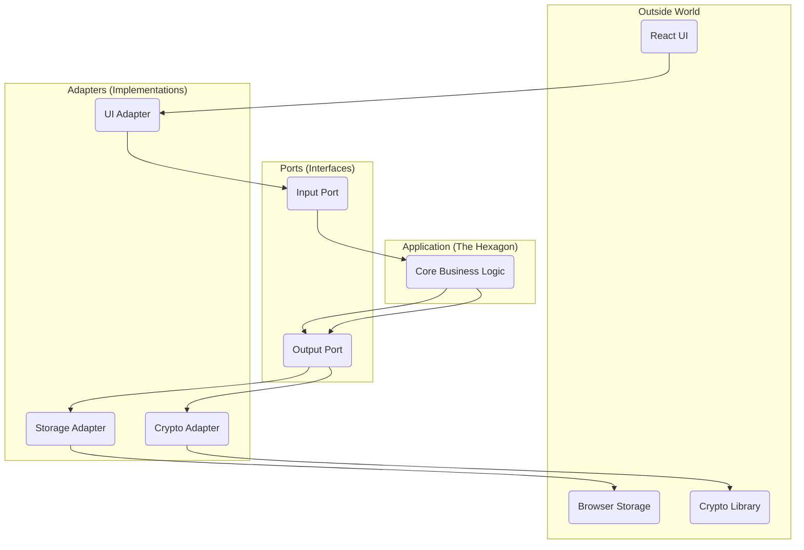
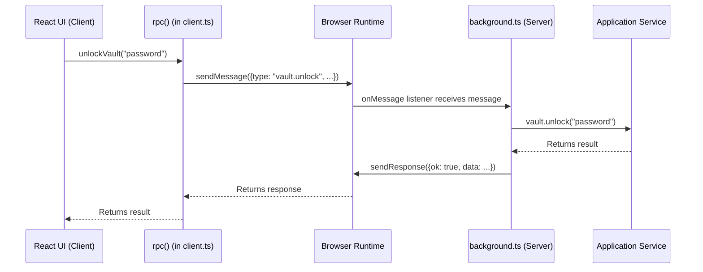

# The Ostrilo Architectural Primer: A Guide to Hexagonal Architecture and RPC

Welcome to the Ostrilo Architectural Primer! This guide is designed to give you a deep and practical understanding of the core architectural patterns that power the Ostrilo extension. By the end of this guide, you will be highly knowledgeable about Hexagonal Architecture (Ports and Adapters) and the Remote Procedure Call (RPC) pattern as they are used in this project.

Understanding these patterns is crucial for contributing effectively, debugging with ease, and appreciating the design decisions that make Ostrilo robust, maintainable, and secure.

## Chapter 1: The "Why" - Problems with Traditional Architectures

Many applications are built using a traditional **Layered Architecture**. You can think of it like a multi-story building where each floor depends on the one below it.

```
   +-----------------+
   |   UI Layer      |  (The top floor, what the user sees)
   +-----------------+
           |
           v
   +-----------------+
   | Business Logic  |  (The middle floor, where the work gets done)
   +-----------------+
           |
           v
   +-----------------+
   | Data Access     |  (The ground floor, connected to the database)
   +-----------------+
```

This seems logical, but it has some significant drawbacks:

*   **Rigidity:** The layers are tightly coupled. If you want to change the database on the ground floor, you might have to renovate the entire building. The business logic is "stuck" to the specific database technology.
*   **Fragility:** A small change in a lower layer can cause unexpected cracks and breaks in the layers above.
*   **Difficult to Test:** How do you test the business logic on the middle floor without the database on the ground floor? It's difficult to test the core rules of your application in isolation.
*   **Technology Lock-in:** The core logic is not independent. It's "contaminated" by the details of the UI and the database.

## Chapter 2: Introducing Hexagonal Architecture (Ports and Adapters)

Hexagonal Architecture, also known as **Ports and Adapters**, offers a solution to these problems. It flips the traditional layered model on its head.

Imagine your application's core logic is a self-contained **hexagon**. This hexagon is pure and independent. It doesn't know or care about the outside world.

To communicate with the outside world, the hexagon has **ports**. These are like the sockets on the wall of a house. They define a standard way to plug things in.

To use these ports, you need **adapters**. These are the plugs that fit into the sockets. They are the "glue" that connects the outside world to your application's core.



### Key Terms Explained

*   **The Hexagon (The Application Core):** This is the heart of your application. It contains the pure business logic and has no dependencies on any external technology. In Ostrilo, this is the `src/domain` directory.
*   **Ports:** These are interfaces that define a contract for communication. They are part of the application core.
    *   **Driving/Input Ports:** These are called by the outside world to *drive* the application. They are the entry point to the hexagon. In Ostrilo, these are represented by the methods on the application services in `src/application/services`.
    *   **Driven/Output Ports:** These are called by the application to interact with external services. They are the exit point from the hexagon. In Ostrilo, these are the interfaces in `src/application/ports`.
*   **Adapters:** These are the concrete implementations of the ports. They live outside the hexagon.
    *   **Driving/Primary Adapters:** These wrap the driving ports and translate external requests into calls to the application core. The React components in `src/ui` are a primary adapter.
    *   **Driven/Secondary Adapters:** These implement the driven ports and interact with external services. The `LocalStorageAdapter` in `src/infrastructure/storage/adapters.ts` is a secondary adapter.

## Chapter 3: A Deeper Dive into the Ostrilo Hexagon

Let's see how this looks in the Ostrilo codebase:

*   **`src/domain` (The Hexagon):** This is the core. It contains the pure business logic, like how to validate a Nostr event or how to encrypt data. It has zero dependencies on the rest of the application.
*   **`src/application/ports` (The Ports):** This directory defines the interfaces for the outside world. For example, `src/application/ports/storage.ts` defines the `IStorage` interface, which specifies that there must be a way to `get`, `set`, and `remove` data.
*   **`src/application/services` (The Application Logic):** These services orchestrate the domain logic. They use the ports to interact with the outside world. For example, `KeyVaultService` uses the `IStorage` port to save encrypted keys.
*   **`src/infrastructure` (The Adapters):** This is where the ports are implemented. `src/infrastructure/storage/adapters.ts` provides the `LocalStorageAdapter` which implements the `IStorage` port using the browser's `localStorage` API.
*   **`src/ui` (A Driving Adapter):** The React components in the UI call the application services to get work done. For example, when you click the "Unlock" button, the UI calls the `unlock` method on the `KeyVaultService`.

## Chapter 4: The RPC Pattern in Ostrilo

### What is RPC?

**Remote Procedure Call (RPC)** is a way for one part of a program to execute a procedure (or function) in another part of the program as if it were a local call.

### Why is RPC needed in a browser extension?

A browser extension is not a single, monolithic application. It runs in multiple, isolated contexts:

*   **Popup:** The UI that appears when you click the extension icon.
*   **Side Panel:** The UI that can be docked to the side of the browser.
*   **Content Scripts:** Scripts that run in the context of a web page.
*   **Background Script:** A long-running script that manages the extension's state and logic.

These contexts cannot directly call functions in each other. They need a way to communicate. This is where RPC comes in.

### How RPC works in Ostrilo

In Ostrilo, the UI (running in the popup or side panel) needs to talk to the application services (running in the background script). We use a simple, message-based RPC system to achieve this.

Here's the flow of an RPC call:



1.  **The UI calls a function:** The React UI calls a function from `src/infrastructure/messaging/client.ts`, for example `unlockVault("password")`.
2.  **The client sends a message:** The `rpc` function in `client.ts` constructs a message object (e.g., `{ type: "vault.unlock", password: "password" }`) and sends it using `browser.runtime.sendMessage`.
3.  **The background script receives the message:** The `onMessage` listener in `src/extension/background.ts` receives the message.
4.  **The background script calls the service:** The background script uses a `switch` statement to determine which service method to call based on the message `type`. It then calls the appropriate method on the application service (e.g., `vault.unlock("password")`).
5.  **The background script sends the response:** Once the service method returns, the background script wraps the result in a response object (e.g., `{ ok: true, data: ... }`) and sends it back using the `sendResponse` function.
6.  **The client receives the response:** The `rpc` function in `client.ts` receives the response and returns the data to the UI.

The RPC system itself is another **adapter** in our Hexagonal Architecture. It's part of the infrastructure that allows the UI (a driving adapter) to communicate with the application core.

## Chapter 5: From Beginner to Expert - Advanced Concepts

### Testing

Hexagonal Architecture makes testing a breeze:

*   **Domain Logic:** The `src/domain` directory can be tested in complete isolation. It's just pure functions and business rules.
*   **Application Services:** You can test the application services by providing "mock" implementations of the ports. For example, you can create a mock storage adapter that just stores data in memory, instead of relying on the browser's `localStorage`.
*   **Adapters:** You can test the adapters to ensure they correctly interact with the external services.

### The Dependency Inversion Principle

Hexagonal Architecture is a direct application of the **Dependency Inversion Principle**, one of the SOLID principles of object-oriented design. This principle states that:

> High-level modules should not depend on low-level modules. Both should depend on abstractions.

In our case, the application core (high-level module) does not depend on the infrastructure (low-level module). Both depend on the ports (abstractions).

## Chapter 6: Tutorial - Adding a New Feature

Theory is great, but practice is better. Let's walk through adding a simple feature to Ostrilo to see how the architecture works in practice.

**The Feature:** We will add the ability to store a private, encrypted note for each key in the vault.

### Step 1: Define the Domain (The Hexagon)

We start at the very core of our application. The `KeyRecord` is our central domain object. We need to add a place for our note.

**File:** `src/domain/types.ts`

```typescript
export interface KeyRecord {
  id: string;
  pubkey: string;
  label?: string;
  encryptedPrivateKey: string;
  // Add the new note field
  note?: string;
}
```

That's it. The domain now understands that a key can have a note. This change is pure and has no side effects.

### Step 2: Update the Application Layer (Services)

Now, we need to teach our application how to handle this new note. We'll add a new method to our `KeyVaultService` to update the note.

**File:** `src/application/services/key-vault.service.ts`

We'll add a new method called `setKeyNote`.

```typescript
// Inside the KeyVaultService class

public async setKeyNote(keyId: string, note: string): Promise<void> {
  const keyRecord = await this.storage.get(keyId);
  if (!keyRecord) {
    throw new Error("Key not found");
  }

  // Update the note
  keyRecord.note = note;

  // Save the updated record
  await this.storage.set(keyId, keyRecord);
}
```
*(Note: In a real implementation, the `KeyRecord` would be encrypted, so you would need to decrypt it first, update the note, and then re-encrypt it. We're keeping it simple here to focus on the pattern.)*

Our application service now has a new capability. Notice we are still just using the `IStorage` port. We haven't touched any specific infrastructure.

### Step 3: Expose the Feature via RPC (The Messaging Adapter)

Our UI needs a way to call the new `setKeyNote` method. We'll expose it through our RPC layer.

**File:** `src/infrastructure/messaging/rpc.ts`

Add a new type to our `RpcRequest` union:

```typescript
export type RpcRequest =
  // ... existing types
  | { type: "vault.setKeyNote"; keyId: string; note: string };
```

**File:** `src/extension/background.ts`

Handle the new message type in the `onMessage` listener:

```typescript
// Inside the onMessage listener's switch statement
case "vault.setKeyNote": {
  await vault.setKeyNote(message.keyId, message.note);
  result = { ok: true, data: null } as const;
  break;
}
```

**File:** `src/infrastructure/messaging/client.ts`

Create a new client function to call the RPC method:

```typescript
export async function setKeyNote(keyId: string, note: string) {
  return rpc<null>({ type: "vault.setKeyNote", keyId, note });
}
```

Now, our UI has a way to securely call the background service to set a note.

### Step 4: Build the UI (The Driving Adapter)

With the backend logic in place, we can build the UI. We'll create a new component to edit the note.

**File:** `src/ui/features/profile/components/KeyNoteEditor.tsx` (You would create this new file)

```typescript
import React, { useState } from 'react';
import { Button } from '@/components/ui/button';
import { Label } from '@/components/ui/label';
import { Textarea } from '@/components/ui/textarea';
import { useKeyNote } from '@/hooks/useKeyNote'; // We will create this next

export function KeyNoteEditor({ keyId, currentNote }: { keyId: string; currentNote?: string }) {
  const [note, setNote] = useState(currentNote || '');
  const { saveNote, isSaving } = useKeyNote();

  const handleSave = () => {
    saveNote(keyId, note);
  };

  return (
    <div className="grid w-full gap-1.5">
      <Label htmlFor="note">Your Private Note</Label>
      <Textarea
        id="note"
        value={note}
        onChange={(e) => setNote(e.target.value)}
        placeholder="Type your note here."
      />
      <Button onClick={handleSave} disabled={isSaving}>
        {isSaving ? 'Saving...' : 'Save Note'}
      </Button>
    </div>
  );
}
```

### Step 5: Create a Custom Hook for UI Logic

To keep our component clean, we'll encapsulate the logic for saving the note in a custom hook.

**File:** `src/ui/hooks/useKeyNote.ts` (You would create this new file)

```typescript
import { useState } from 'react';
import { setKeyNote } from '@/infrastructure/messaging/client';

export function useKeyNote() {
  const [isSaving, setIsSaving] = useState(false);
  const [error, setError] = useState<string | null>(null);

  const saveNote = async (keyId: string, note: string) => {
    setIsSaving(true);
    setError(null);
    try {
      await setKeyNote(keyId, note);
    } catch (e: any) {
      setError(e.message);
    } finally {
      setIsSaving(false);
    }
  };

  return { saveNote, isSaving, error };
}
```

### Step 6: Integrate the New Component

Finally, we'll add our new `KeyNoteEditor` component to an existing view, for example, the `ProfileView`.

**File:** `src/ui/features/profile/components/ProfileView.tsx`

You would find the currently selected key and pass its ID and current note to the `KeyNoteEditor`.

```typescript
// Inside the ProfileView component...
// ... find the selectedKey from a list of keys

{selectedKey && (
  <KeyNoteEditor keyId={selectedKey.id} currentNote={selectedKey.note} />
)}
```

### Tutorial Recap

Let's review the journey:

1.  **Domain:** We defined the `note` field. Pure data, no logic.
2.  **Application:** We created a `setKeyNote` service method. Pure logic, no infrastructure.
3.  **Infrastructure (RPC):** We created a "wire" to connect the outside world to our application logic.
4.  **UI (React):** We built a component to interact with the user.
5.  **UI Logic (Hook):** We encapsulated the UI's interaction with the RPC layer.

Each step was self-contained and followed a predictable pattern. This is the power of Hexagonal Architecture. It provides a clear roadmap for extending the application in a way that is maintainable, testable, and scalable.

## Conclusion

By embracing Hexagonal Architecture and a clear RPC pattern, Ostrilo achieves a clean separation of concerns. This makes the codebase more flexible, testable, and easier to reason about.

As you explore the code, keep the concepts of the hexagon, ports, and adapters in mind. You'll start to see how the different pieces of the application fit together to create a robust and maintainable system. Happy coding!