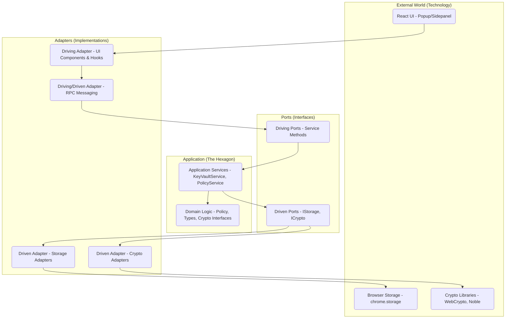
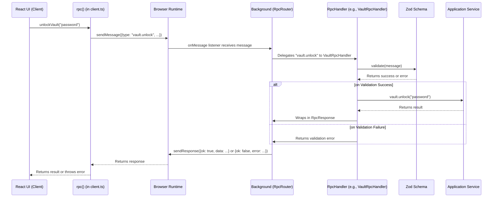

# The Ostrilo Architectural Primer: A Guide to Hexagonal Architecture and RPC

Welcome to the Ostrilo Architectural Primer! This guide is designed to give you a deep and practical understanding of the core architectural patterns that power the Ostrilo extension. By the end of this guide, you will be highly knowledgeable about Hexagonal Architecture (Ports and Adapters) and the Remote Procedure Call (RPC) pattern as they are used in this project.

Understanding these patterns is crucial for contributing effectively, debugging with ease, and appreciating the design decisions that make Ostrilo robust, maintainable, and secure.

## Chapter 1: The "Why" - Problems with Traditional Architectures

Many applications are built using a traditional **Layered Architecture**. You can think of it like a multi-story building where each floor depends on the one below it.

```
   +-----------------+
   |   UI Layer      |  (The top floor, what the user sees)
   +-----------------+
           |
           v
   +-----------------+
   | Business Logic  |  (The middle floor, where the work gets done)
   +-----------------+
           |
           v
   +-----------------+
   | Data Access     |  (The ground floor, connected to the database)
   +-----------------+
```

This seems logical, but it has some significant drawbacks:

- **Rigidity:** The layers are tightly coupled. If you want to change the database on the ground floor, you might have to renovate the entire building. The business logic is "stuck" to the specific database technology.
- **Fragility:** A small change in a lower layer can cause unexpected cracks and breaks in the layers above.
- **Difficult to Test:** How do you test the business logic on the middle floor without the database on the ground floor? It's difficult to test the core rules of your application in isolation.
- **Technology Lock-in:** The core logic is not independent. It's "contaminated" by the details of the UI and the database.

## Chapter 2: Introducing Hexagonal Architecture (Ports and Adapters)

Hexagonal Architecture, also known as **Ports and Adapters**, offers a solution to these problems. It flips the traditional layered model on its head.

Imagine your application's core logic is a self-contained **hexagon**. This hexagon is pure and independent. It doesn't know or care about the outside world.

To communicate with the outside world, the hexagon has **ports**. These are like the sockets on the wall of a house. They define a standard way to plug things in.

To use these ports, you need **adapters**. These are the plugs that fit into the sockets. They are the "glue" that connects the outside world to your application's core.



### The Philosophy and Origins

The Hexagonal Architecture pattern was first described by **Alistair Cockburn** in the early 2000s. His goal was to solve a common problem: the entanglement of core business logic with external technology concerns.

The key insight was to create a clear, formalized boundary around the "application" and to allow it to be "driven" by different actors in a symmetrical way. Whether the driver is a human user clicking a button, an automated test suite, or another computer system, the application core should not know the difference. This is why the shape is a hexagon—the number of sides is not literally six, but is meant to represent the many different "sides" or "ports" the application might have to interact with various external tools.

### Key Terms Explained

- **The Hexagon (The Application Core):** This is the heart of your application. It contains the pure business logic and has no dependencies on any external technology. In Ostrilo, this is the `src/domain` and `src/application` directories.
- **Ports:** These are interfaces that define a contract for communication.
  - **Driving/Input Ports:** These are called by the outside world to _drive_ the application. They are the entry point to the hexagon. In Ostrilo, these are the public methods on the application services in `src/application/services`.
  - **Driven/Output Ports:** These are called by the application to interact with external services. They are the exit point from the hexagon. In Ostrilo, these are the interfaces in `src/application/ports` (e.g., `storage.ts`).
- **Adapters:** These are the concrete implementations of the ports. They live outside the hexagon in `src/infrastructure`.
  - **Driving/Primary Adapters:** These wrap the driving ports and translate external requests into calls to the application core. The React components in `src/ui` and the RPC message handlers are primary adapters.
  - **Driven/Secondary Adapters:** These implement the driven ports and interact with external services. The `LocalStorageAdapter` in `src/infrastructure/storage/adapters.ts` is a secondary adapter.

### Ports and Adapters in Code: A Simple Example

Let's make this concrete with a simplified code example. Imagine we have a service to manage users.

#### 1. The Domain Object

This is a simple data structure with no logic.

```typescript
// In the Domain layer
export interface User {
  id: string;
  name: string;
}
```

#### 2. The Port (The Contract)

This is the **Driven/Output Port**. It's an interface that defines _what_ we need to do with users (e.g., find one), but not _how_. It lives inside the application layer.

```typescript
// src/application/ports/user-repository.ts
import { User } from "@/domain/user";

export interface IUserRepository {
  findById(id: string): Promise<User | null>;
  save(user: User): Promise<void>;
}
```

#### 3. The Application Service

The service depends on the **port (the interface)**, not on any specific database or storage mechanism. This keeps the core logic pure.

```typescript
// src/application/services/user.service.ts
import { IUserRepository } from "../ports/user-repository";
import { User } from "@/domain/user";

export class UserService {
  // The service depends on the abstraction (the port), not a concrete implementation.
  constructor(private readonly userRepository: IUserRepository) {}

  public async findUser(id: string): Promise<User | null> {
    return this.userRepository.findById(id);
  }
}
```

#### 4. The Adapter (The Implementation)

This is the **Driven/Secondary Adapter**. It implements the port's contract using a specific technology. Here, we'll use a simple in-memory array, but it could just as easily be a database.

```typescript
// src/infrastructure/storage/in-memory-user-repository.ts
import { IUserRepository } from "@/application/ports/user-repository";
import { User } from "@/domain/user";

export class InMemoryUserRepository implements IUserRepository {
  private users: Map<string, User> = new Map();

  async findById(id: string): Promise<User | null> {
    return this.users.get(id) || null;
  }

  async save(user: User): Promise<void> {
    this.users.set(user.id, user);
  }
}
```

Because `UserService` only depends on the `IUserRepository` interface, we could easily create a `PrismaUserRepository` or `FirebaseUserRepository` and "plug it in" without changing a single line of code in `UserService`.

#### 5. The Driving Adapter (Putting it all together)

The **Driving/Primary Adapter** is what initiates the action. This could be a UI component, an RPC handler, or a test. It's responsible for creating the service with a concrete adapter.

```typescript
// In a test file or a composition root like src/extension/background.ts

import { UserService } from "@/application/services/user.service";
import { InMemoryUserRepository } from "@/infrastructure/storage/in-memory-user-repository";

// 1. Create the adapter (the concrete implementation)
const userRepository = new InMemoryUserRepository();

// 2. Create the service, injecting the adapter
const userService = new UserService(userRepository);

// 3. Use the service
async function main() {
  await userRepository.save({ id: "1", name: "Alice" });
  const user = await userService.findUser("1");
  console.log(user); // { id: '1', name: 'Alice' }
}

main();
```

This example demonstrates the core benefit: the `UserService` (application logic) is completely decoupled from the `InMemoryUserRepository` (infrastructure), connected only by the `IUserRepository` (port).

## Chapter 3: A Deeper Dive into the Ostrilo Hexagon

Let's see how this looks in the Ostrilo codebase:

- **`src/domain` (The Core of the Hexagon):** This is the most inner part. It contains pure, independent business logic and types. It has zero dependencies on the rest of the application.

  - `types.ts`: Defines core data structures like `KeyRecord` and `OriginPolicy`.
  - `policy/evaluate.ts`: A pure function for evaluating security policies.
  - `utils/`: Pure utility functions for things like encoding and validation.

- **`src/application` (The Application Layer):** This layer orchestrates the domain logic. It defines the application's capabilities.

  - `ports/`: Defines the interfaces (output ports) for external services. For example, `src/application/ports/storage.ts` defines the `IStorage` interface, which specifies a contract for storage, and `crypto.ts` defines interfaces like `CryptoAead` and `Schnorr`.
  - `services/`: Contains the application services that implement core use cases. For example, `KeyVaultService` manages keys, `PolicyService` manages permissions, `SettingsService` manages user settings, `ActivityLogService` manages the persistent activity log with a ring buffer, and `ApprovalQueueService` manages pending approval requests. These services are the primary entry point (input ports) to the application logic.

- **`src/infrastructure` (The Adapters):** This is where the ports are implemented. It's the bridge between the application and the outside world.

  - `storage/adapters.ts`: Provides `StorageAdapter` which implements the `IStorage` port using the browser's `chrome.storage` API.
  - `crypto/adapters.ts`: Implements the crypto ports using WebCrypto for AES-GCM and the Noble library for Schnorr signatures.
  - `messaging/`: Contains the RPC system, which acts as an adapter for communication between the UI and the background script.

- **`src/ui` (A Driving Adapter):** The React components, hooks, and state management that make up the user interface. The UI calls the application services (via the RPC adapter) to get work done.

- **`src/extension` (Composition Root & Entrypoints):** This directory contains the browser extension's entry points. The crucial `background.ts` script acts as the "composition root," where all the services and adapters are instantiated and wired together.

## Chapter 4: The RPC Pattern in Ostrilo

### What is RPC?

**Remote Procedure Call (RPC)** is a way for one part of a program to execute a procedure (or function) in another part of the program as if it were a local call.

### Why is RPC needed in a browser extension?

A browser extension is not a single, monolithic application. It runs in multiple, isolated contexts:

- **Popup:** The UI that appears when you click the extension icon.
- **Side Panel:** The UI that can be docked to the side of the browser.
- **Content Scripts:** Scripts that run in the context of a web page.
- **Background Script:** A long-running script that manages the extension's state and logic.

These contexts cannot directly call functions in each other. They need a way to communicate. This is where RPC comes in.

### How RPC works in Ostrilo

Ostrilo uses a robust, modular, and type-safe RPC system. It has evolved from a simple message-passing system to a sophisticated architecture with clear boundaries and runtime validation.

Here's the flow of an RPC call:



1.  **The UI calls a client function:** The React UI calls a typed function from `src/infrastructure/messaging/client.ts`, for example `unlockVault("password")`.
2.  **The client sends a message:** The `rpc` function in `client.ts` constructs a message and sends it using `browser.runtime.sendMessage`.
3.  **The RpcRouter receives the message:** The `onMessage` listener in `src/extension/background.ts` passes the message to the `RpcRouter`.
4.  **The Router delegates to a Handler:** The router inspects the message `type` (e.g., `"vault.unlock"`) and delegates the request to the appropriate registered handler, such as `VaultRpcHandler`. These handlers are located in `src/infrastructure/messaging/handlers/`.
5.  **The Handler validates the input:** Before any processing, the handler uses a **Zod schema** to validate the entire message. This provides crucial runtime safety, ensuring that no malformed or unexpected data reaches the core application.
6.  **The Handler calls the Service:** If validation passes, the handler calls the appropriate method on the application service (e.g., `keyVaultService.unlock(...)`).
7.  **The response is returned:** The result from the service is wrapped in a standardized `RpcResponse` object and sent back through the browser runtime to the original caller in the UI.

This modular RPC system is another **adapter** in our Hexagonal Architecture. It provides a secure and maintainable way for driving adapters (like the UI) to communicate with the application core.

## Chapter 5: From Beginner to Expert - Advanced Concepts

### Testing

Hexagonal Architecture makes testing a breeze, and Ostrilo's test suite is structured to mirror the architecture, as detailed in `tests/TESTING.md`.

- **`tests/unit/domain`:** Tests the pure business logic in complete isolation.
- **`tests/unit/application`:** Tests the application services by providing "mock" implementations of the ports (e.g., an in-memory storage adapter).
- **`tests/unit/infrastructure`:** Tests the adapters, including the important RPC validation schemas.
- **`tests/integration`:** Verifies that the different layers and services work together correctly.
- **`tests/security`:** Focuses on cryptographic correctness and memory safety.
- **`tests/e2e`:** Uses Playwright to test the full application, from UI interaction to background logic, in a real browser environment.

### The Dependency Inversion Principle

Hexagonal Architecture is a direct application of the **Dependency Inversion Principle**, one of the SOLID principles of object-oriented design. This principle states that:

> High-level modules should not depend on low-level modules. Both should depend on abstractions.

In our case, the application core (`src/application`, a high-level module) does not depend on the infrastructure (`src/infrastructure`, a low-level module). Both depend on the ports (`src/application/ports`, abstractions). This inversion of control is the key to the architecture's flexibility and testability.

## Chapter 6: Tutorial - Adding a New Feature

Theory is great, but practice is better. Let's walk through adding a simple feature to Ostrilo to see how the architecture works in practice.

**The Feature:** We will add the ability to store a private, encrypted note for each key in the vault.

### Step 1: Define the Domain (The Hexagon)

We start at the very core of our application. The `KeyRecord` is our central domain object. We need to add a place for our note.

**File:** `src/domain/types.ts`

```typescript
export interface KeyRecord {
  id: string;
  pubkey: string;
  label?: string;
  encryptedPrivateKey: string;
  // Add the new note field
  note?: string;
}
```

That's it. The domain now understands that a key can have a note. This change is pure and has no side effects.

### Step 2: Update the Application Layer (Services)

Now, we need to teach our application how to handle this new note. We'll add a new method to our `KeyVaultService` to update the note.

**File:** `src/application/services/key-vault.service.ts`

```typescript
// Inside the KeyVaultService class

public async setKeyNote(keyId: string, note: string): Promise<void> {
  // Note: In a real implementation, this would involve decrypting the
  // key record, updating it, and re-encrypting it. We simplify here.
  const keyRecord = await this.storage.get(keyId);
  if (!keyRecord) {
    throw new Error("Key not found");
  }

  // Update the note
  keyRecord.note = note;

  // Save the updated record
  await this.storage.set(keyId, keyRecord);
}
```

Our application service now has a new capability. Notice we are still just using the `IStorage` port. We haven't touched any specific infrastructure.

### Step 3: Expose the Feature via RPC (The Messaging Adapter)

Our UI needs a way to call the new `setKeyNote` method. We'll expose it through our RPC layer.

**File:** `src/infrastructure/messaging/rpc.ts`

Add a new type to our `RpcRequest` union:

```typescript
export type RpcRequest =
  // ... existing types
  { type: "vault.setKeyNote"; payload: { keyId: string; note: string } };
```

**File:** `src/infrastructure/validation/schemas.ts` (or a similar validation file)

Add a Zod schema for the new message payload:

```typescript
export const SetKeyNotePayloadSchema = z.object({
  keyId: z.string().uuid(),
  note: z.string().max(1000), // Example validation
});
```

**File:** `src/infrastructure/messaging/handlers/vault-rpc.ts`

Handle the new message type in the `VaultRpcHandler`:

```typescript
// Inside the VaultRpcHandler's handleRequest method's switch statement
case "vault.setKeyNote": {
  const validation = SetKeyNotePayloadSchema.safeParse(message.payload);
  if (!validation.success) {
    // Return a validation error
    return { ok: false, error: "invalid_payload", issues: validation.error.issues };
  }
  await context.vault.setKeyNote(validation.data.keyId, validation.data.note);
  return { ok: true, data: null };
}
```

**File:** `src/infrastructure/messaging/client.ts`

Create a new client function to call the RPC method:

```typescript
export async function setKeyNote(keyId: string, note: string): Promise<void> {
  await rpc<null>({ type: "vault.setKeyNote", payload: { keyId, note } });
}
```

Now, our UI has a secure, validated way to call the background service.

### Step 4: Build the UI (The Driving Adapter)

With the backend logic in place, we can build the UI.

**File:** `src/ui/features/profile/components/KeyNoteEditor.tsx` (A new file)

```typescript
import React, { useState } from "react";
import { Button } from "@/ui/components/ui/button";
import { Label } from "@/ui/components/ui/label";
import { Textarea } from "@/ui/components/ui/textarea";
import { useKeyNote } from "@/ui/hooks/useKeyNote"; // We will create this next

export function KeyNoteEditor({
  keyId,
  currentNote,
}: {
  keyId: string;
  currentNote?: string;
}) {
  const [note, setNote] = useState(currentNote || "");
  const { saveNote, isSaving } = useKeyNote();

  const handleSave = () => {
    saveNote(keyId, note);
  };

  return (
    <div className="grid w-full gap-1.5">
      <Label htmlFor="note">Your Private Note</Label>
      <Textarea
        id="note"
        value={note}
        onChange={(e) => setNote(e.target.value)}
        placeholder="Type your note here."
      />
      <Button onClick={handleSave} disabled={isSaving}>
        {isSaving ? "Saving..." : "Save Note"}
      </Button>
    </div>
  );
}
```

### Step 5: Create a Custom Hook for UI Logic

To keep our component clean, we'll encapsulate the logic for saving the note in a custom hook.

**File:** `src/ui/hooks/useKeyNote.ts` (A new file)

```typescript
import { useState } from "react";
import { setKeyNote } from "@/infrastructure/messaging/client";

export function useKeyNote() {
  const [isSaving, setIsSaving] = useState(false);
  const [error, setError] = useState<string | null>(null);

  const saveNote = async (keyId: string, note: string) => {
    setIsSaving(true);
    setError(null);
    try {
      await setKeyNote(keyId, note);
    } catch (e: any) {
      setError(e.message);
    } finally {
      setIsSaving(false);
    }
  };

  return { saveNote, isSaving, error };
}
```

### Step 6: Integrate the New Component

Finally, add the `KeyNoteEditor` to an existing view, like `ProfileView.tsx`.

### Tutorial Recap

Let's review the journey:

1.  **Domain:** We defined the `note` field. Pure data.
2.  **Application:** We created a `setKeyNote` service method. Pure application logic.
3.  **Infrastructure (RPC):** We created a "wire" with validation to connect the outside world to our application logic.
4.  **UI (React):** We built a component for user interaction.
5.  **UI Logic (Hook):** We encapsulated the UI's interaction with the RPC layer.

Each step was self-contained and followed a predictable pattern. This is the power of Hexagonal Architecture. It provides a clear roadmap for extending the application in a way that is maintainable, testable, and scalable.

## Conclusion

By embracing Hexagonal Architecture and a robust RPC pattern, Ostrilo achieves a clean separation of concerns. This makes the codebase more flexible, testable, and easier to reason about.

As you explore the code, keep the concepts of the hexagon, ports, and adapters in mind. You'll start to see how the different pieces of the application fit together to create a powerful and secure system. Happy coding!
