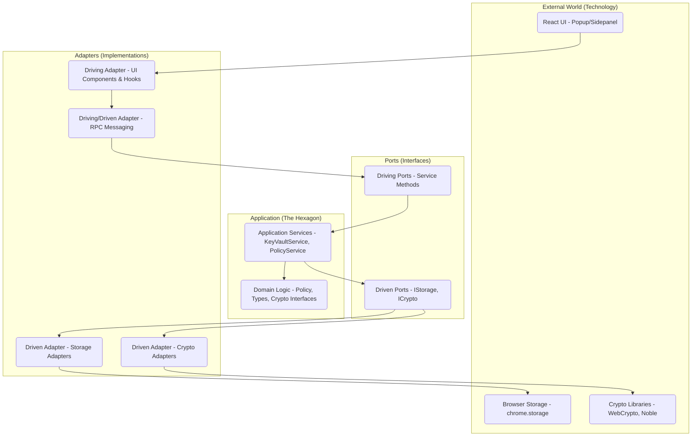
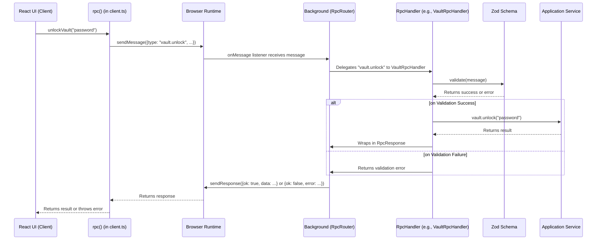

# The Ostrilo Architectural Primer: A Guide to Hexagonal Architecture and RPC

Welcome to the Ostrilo Architectural Primer! This guide is designed to give you a deep and practical understanding of the core architectural patterns that power the Ostrilo extension. By the end of this guide, you will be highly knowledgeable about Hexagonal Architecture (Ports and Adapters) and the Remote Procedure Call (RPC) pattern as they are used in this project.

Understanding these patterns is crucial for contributing effectively, debugging with ease, and appreciating the design decisions that make Ostrilo robust, maintainable, and secure.

## Chapter 1: The "Why" - Problems with Traditional Architectures

Many applications are built using a traditional **Layered Architecture**. You can think of it like a multi-story building where each floor depends on the one below it.

```
   +-----------------+
   |   UI Layer      |  (The top floor, what the user sees)
   +-----------------+
           |
           v
   +-----------------+
   | Business Logic  |  (The middle floor, where the work gets done)
   +-----------------+
           |
           v
   +-----------------+
   | Data Access     |  (The ground floor, connected to the database)
   +-----------------+
```

This seems logical, but it has some significant drawbacks:

- **Rigidity:** The layers are tightly coupled. If you want to change the database on the ground floor, you might have to renovate the entire building. The business logic is "stuck" to the specific database technology.
- **Fragility:** A small change in a lower layer can cause unexpected cracks and breaks in the layers above.
- **Difficult to Test:** How do you test the business logic on the middle floor without the database on the ground floor? It's difficult to test the core rules of your application in isolation.
- **Technology Lock-in:** The core logic is not independent. It's "contaminated" by the details of the UI and the database.

## Chapter 2: Introducing Hexagonal Architecture (Ports and Adapters)

Hexagonal Architecture, also known as **Ports and Adapters**, offers a solution to these problems. It flips the traditional layered model on its head.

Imagine your application's core logic is a self-contained **hexagon**. This hexagon is pure and independent. It doesn't know or care about the outside world.

To communicate with the outside world, the hexagon has **ports**. These are like the sockets on the wall of a house. They define a standard way to plug things in.

To use these ports, you need **adapters**. These are the plugs that fit into the sockets. They are the "glue" that connects the outside world to your application's core.



### The Philosophy and Origins

The Hexagonal Architecture pattern was first described by **Alistair Cockburn** in the early 2000s. His goal was to solve a common problem: the entanglement of core business logic with external technology concerns.

The key insight was to create a clear, formalized boundary around the "application" and to allow it to be "driven" by different actors in a symmetrical way. Whether the driver is a human user clicking a button, an automated test suite, or another computer system, the application core should not know the difference. This is why the shape is a hexagon—the number of sides is not literally six, but is meant to represent the many different "sides" or "ports" the application might have to interact with various external tools.

### Key Terms Explained

- **The Hexagon (The Application Core):** This is the heart of your application. It contains the pure business logic and has no dependencies on any external technology. In Ostrilo, this is the `src/domain` and `src/application` directories.
- **Ports:** These are interfaces that define a contract for communication.
  - **Driving/Input Ports:** These are called by the outside world to _drive_ the application. They are the entry point to the hexagon. In Ostrilo, these are the public methods on the application services in `src/application/services`.
  - **Driven/Output Ports:** These are called by the application to interact with external services. They are the exit point from the hexagon. In Ostrilo, these are the interfaces in `src/application/ports` (e.g., `storage.ts`).
- **Adapters:** These are the concrete implementations of the ports. They live outside the hexagon in `src/infrastructure`.
  - **Driving/Primary Adapters:** These wrap the driving ports and translate external requests into calls to the application core. The React components in `src/ui` and the RPC message handlers are primary adapters.
  - **Driven/Secondary Adapters:** These implement the driven ports and reach external systems. `createStorageSuite()` in `src/infrastructure/storage/adapters.ts` builds the `StorageSuite` that satisfies the storage port in `src/application/ports/storage.ts`, backed by the `browser.storage` areas (`local`, `sync` and `session`).

### Ports and Adapters in Code: The Crypto Port

The clearest instance of the pattern in this repository is the crypto port. The
application layer needs BIP-340 signatures and SHA-256 hashes, but it must not
import a crypto library to get them: `src/infrastructure/crypto/adapters.ts` is
the only module in `src/` permitted to import `@noble/*` or `@scure/*`, and a
lint rule plus a Vitest assertion keep it that way. That restriction is only
enforceable because the seam below exists.

#### 1. The Port (The Contract)

This is the **Driven/Output Port**. It says _what_ the application needs, not
_how_ it is done, and it lives inside the application layer.

```typescript
// src/application/ports/crypto.ts
export interface Schnorr {
  getPublicKey(sk: Uint8Array): Promise<Uint8Array> | Uint8Array;
  sign(hash32: Uint8Array, sk: Uint8Array): Promise<Uint8Array> | Uint8Array;
  /**
   * BIP-340 verification. Synchronous, unlike `sign` and `getPublicKey`,
   * because the relay trust boundary verifies inside a synchronous WebSocket
   * message handler [...]
   */
  verify(
    signature: Uint8Array,
    hash32: Uint8Array,
    publicKey: Uint8Array
  ): boolean;
}

export interface CryptoHash {
  sha256(data: Uint8Array): Uint8Array;
}
```

The same file defines `CryptoAead`, `CryptoKdf` and `Bech32Codec`, plus the
`SecretBytes` alias (`Uint8Array<ArrayBuffer>`) that the AEAD port uses so
secret material can be handed to WebCrypto without being copied first.

Notice that the port's own comments are about _obligations_, not
implementation: `verify` is synchronous because a caller — the relay trust
boundary — verifies inside a synchronous message handler and cannot become
async without changing its security properties.

#### 2. The Application Service (The Consumer)

`KeyVaultService` depends on the ports, never on a library. Every dependency
arrives through the constructor:

```typescript
// src/application/services/key-vault.service.ts
export class KeyVaultService {
  private unlocked: Map<string, Uint8Array> = new Map();

  constructor(
    private storage: StorageSuite,
    private aead: CryptoAead,
    private kdf: CryptoKdf,
    private schnorr: Schnorr,
    private hash: CryptoHash,
    private bech32: Bech32Codec
  ) {}
```

And this is the single Schnorr call site in the class:

```typescript
// src/application/services/key-vault.service.ts
async sign(
  hashHex: string,
  keyId?: string
): Promise<{ sigHex: string; keyId: string }> {
  if (!isValidHex(hashHex, 32)) throw new Error("hash_must_be_32_bytes");
  const bytes = hexToBytes(hashHex);
  const { keyId: id, sk } = this.ensureUnlockedKey(keyId);
  const sig = await this.schnorr.sign(bytes, sk);
  return { sigHex: bytesToHex(sig), keyId: id };
}
```

`this.schnorr` is the port. Nothing in this file names `@noble/curves`.
`signEvent` on the same class computes the NIP-01 event id with
`computeEventId(this.hash, unsignedEvent)` — the `CryptoHash` port — and then
routes through `this.sign` rather than reaching for a second signing path.

#### 3. The Adapter (The Implementation)

This is the **Driven/Secondary Adapter**. It implements the contract with a
specific library, and it is the only place that library appears.

```typescript
// src/infrastructure/crypto/adapters.ts
import { schnorr } from "@noble/curves/secp256k1.js";

/**
 * Declared with `satisfies` rather than a type annotation so each method keeps
 * its concrete return type. The port allows `sign` and `getPublicKey` to be
 * async; this adapter's are not, and callers that need a synchronous result -
 * the relay trust boundary - depend on that being visible in the type.
 */
export const NobleSchnorr = {
  getPublicKey(sk: Uint8Array): Uint8Array {
    return schnorr.getPublicKey(sk);
  },
  sign(hash32: Uint8Array, sk: Uint8Array): Uint8Array {
    return schnorr.sign(hash32, sk);
  },
  verify(
    signature: Uint8Array,
    hash32: Uint8Array,
    publicKey: Uint8Array
  ): boolean {
    try {
      return schnorr.verify(signature, hash32, publicKey);
    } catch {
      return false;
    }
  },
} satisfies Schnorr;

export const NobleSha256 = {
  sha256(data: Uint8Array): Uint8Array {
    return sha256(data);
  },
} satisfies CryptoHash;
```

`satisfies` rather than `: Schnorr` is a deliberate choice, and the comment
above the declaration is the reason: an annotation would widen `sign` back to
the port's `Promise<Uint8Array> | Uint8Array`, and the synchronous callers
would lose the guarantee they depend on. The adapter may be _narrower_ than
the port; it may never be wider.

The sibling adapters in the same file are `WebCryptoAesGcm` (`CryptoAead`, via
WebCrypto), `VaultKdf` (`CryptoKdf`, Argon2id with a PBKDF2 branch) and
`ScureBech32` (`Bech32Codec`).

#### 4. The Composition Root (Putting It Together)

Nothing above ever chose an implementation. That happens in exactly one place,
the background entrypoint:

```typescript
// src/extension/background.ts
const storage = createStorageSuite();
const vault = new KeyVaultService(
  storage,
  WebCryptoAesGcm,
  VaultKdf,
  NobleSchnorr,
  NobleSha256,
  ScureBech32
);
```

This is what the pattern buys, concretely:

- **The library rule is enforceable.** `KeyVaultService` cannot import
  `@noble/curves` because it has no reason to; the one module that can is small
  enough to audit.
- **Tests substitute the port.**
  `tests/unit/application/keyvault.service.test.ts` builds an in-memory
  `StorageSuite` and passes it to the same constructor, so the service runs
  under Vitest with no browser and no `webextension-polyfill` — nothing in the
  service had to change to make that possible.
- **One signing path.** Because the port is injected, a second implementation
  cannot quietly appear next to it — it would have nowhere to be wired in.

## Chapter 3: A Deeper Dive into the Ostrilo Hexagon

Let's see how this looks in the Ostrilo codebase:

- **`src/domain` (The Core of the Hexagon):** This is the most inner part. It contains pure, independent business logic and types. It has zero dependencies on the rest of the application.

  - `types.ts`: Defines core data structures like `KeyRecord` and `OriginPolicy`.
  - `policy/evaluate.ts`: A pure function for evaluating security policies.
  - `utils/`: Pure utility functions for things like encoding and validation.

- **`src/application` (The Application Layer):** This layer orchestrates the domain logic. It defines the application's capabilities.

  - `ports/`: Defines the interfaces (output ports) for external services. For example, `src/application/ports/storage.ts` defines `StoragePort` - a `get`/`set`/`remove` contract - and the `StorageSuite` that groups one port per browser storage area, and `crypto.ts` defines `CryptoAead`, `CryptoKdf`, `Schnorr`, `CryptoHash` and `Bech32Codec`.
  - `crypto/`: Composition over those ports, with no library import of its own. `event-id.ts` holds the single NIP-01 event id computation and signature verification; `private-key.ts` holds the single private-key parser. Both take the port they need as their first argument rather than owning it, because the vault service and the RPC handlers both need them.
  - `services/`: Contains the application services that implement core use cases. For example, `KeyVaultService` manages keys, `PolicyService` manages permissions, `SettingsService` manages user settings, `ActivityLogService` manages the persistent activity log with a ring buffer, and `ApprovalQueueService` manages pending approval requests. These services are the primary entry point (input ports) to the application logic.

- **`src/infrastructure` (The Adapters):** This is where the ports are implemented. It's the bridge between the application and the outside world.

  - `storage/adapters.ts`: `createStorageSuite()` returns the `StorageSuite` that satisfies the storage port, with one `StoragePort` per area backed by `browser.storage.local`, `.sync` and `.session` through `webextension-polyfill`.
  - `crypto/adapters.ts`: The **only** module in `src/` permitted to import `@noble/*` or `@scure/*`. It implements every crypto port: `WebCryptoAesGcm` (AES-GCM via WebCrypto), `VaultKdf` (Argon2id, with a PBKDF2 branch), `NobleSchnorr` (BIP-340 sign, verify and public-key derivation), `NobleSha256` and `ScureBech32`. A lint rule and a Vitest assertion keep it the only one; see `docs/development-standards.md`.
  - `messaging/`: Contains the RPC system, which acts as an adapter for communication between the UI and the background script.

- **`src/ui` (A Driving Adapter):** The React components, hooks, and state management that make up the user interface. The UI calls the application services (via the RPC adapter) to get work done.

- **`src/extension` (Composition Root & Entrypoints):** This directory contains the browser extension's entry points. The crucial `background.ts` script acts as the "composition root," where all the services and adapters are instantiated and wired together.

## Chapter 4: The RPC Pattern in Ostrilo

### What is RPC?

**Remote Procedure Call (RPC)** is a way for one part of a program to execute a procedure (or function) in another part of the program as if it were a local call.

### Why is RPC needed in a browser extension?

A browser extension is not a single, monolithic application. It runs in multiple, isolated contexts:

- **Popup:** The UI that appears when you click the extension icon.
- **Side Panel:** The UI that can be docked to the side of the browser.
- **Content Scripts:** Scripts that run in the context of a web page.
- **Background Script:** A long-running script that manages the extension's state and logic.

These contexts cannot directly call functions in each other. They need a way to communicate. This is where RPC comes in.

### How RPC works in Ostrilo

Ostrilo uses a robust, modular, and type-safe RPC system. It has evolved from a simple message-passing system to a sophisticated architecture with clear boundaries and runtime validation.

Here's the flow of an RPC call:



1.  **The UI calls a client function:** The React UI calls a typed function from `src/infrastructure/messaging/client.ts`, for example `unlockVault("password")`.
2.  **The client sends a message:** The `rpc` function in `client.ts` constructs a message and sends it using `browser.runtime.sendMessage`.
3.  **The RpcRouter receives the message:** The `onMessage` listener in `src/extension/background.ts` passes the message to the `RpcRouter`.
4.  **The Router delegates to a Handler:** The router inspects the message `type` (e.g., `"vault.unlock"`) and delegates the request to the appropriate registered handler, such as `VaultRpcHandler`. These handlers are located in `src/infrastructure/messaging/handlers/`.
5.  **The Handler validates the input:** Before any processing, the handler uses a **Zod schema** to validate the entire message. This provides crucial runtime safety, ensuring that no malformed or unexpected data reaches the core application.
6.  **The Handler calls the Service:** If validation passes, the handler calls the appropriate method on the application service (e.g., `keyVaultService.unlock(...)`).
7.  **The response is returned:** The result from the service is wrapped in a standardized `RpcResponse` object and sent back through the browser runtime to the original caller in the UI.

This modular RPC system is another **adapter** in our Hexagonal Architecture. It provides a secure and maintainable way for driving adapters (like the UI) to communicate with the application core.

## Chapter 5: From Beginner to Expert - Advanced Concepts

### Testing

Hexagonal Architecture makes testing a breeze, and Ostrilo's test suite is structured to mirror the architecture, as detailed in `TESTING.md`.

- **`tests/unit/domain`:** Tests the pure business logic in complete isolation.
- **`tests/unit/application`:** Tests the application services by providing "mock" implementations of the ports (e.g., an in-memory storage adapter).
- **`tests/unit/infrastructure`:** Tests the adapters, including the important RPC validation schemas.
- **`tests/integration`:** Verifies that the different layers and services work together correctly.
- **`tests/security`:** Focuses on cryptographic correctness and memory safety.
- **`tests/e2e`:** Uses Playwright to test the full application, from UI interaction to background logic, in a real browser environment.

### The Dependency Inversion Principle

Hexagonal Architecture is a direct application of the **Dependency Inversion Principle**, one of the SOLID principles of object-oriented design. This principle states that:

> High-level modules should not depend on low-level modules. Both should depend on abstractions.

In our case, the application core (`src/application`, a high-level module) does not depend on the infrastructure (`src/infrastructure`, a low-level module). Both depend on the ports (`src/application/ports`, abstractions). This inversion of control is the key to the architecture's flexibility and testability.

## Chapter 6: Walkthrough - A Signing Request, End to End

Everything above describes structure. This chapter follows one request through
it: a web page calls `window.nostr.signEvent(...)`, and either a signed event
comes back or it does not. This is the path every security claim in the README
rests on, and the one worth reading with the source open next to it — each stop
below names the file it lives in.

The seven stops:

1. **The page** — `src/extension/injected.ts`
2. **The provider boundary** — `src/extension/content.ts`, `wxt.config.ts`
3. **Validation** — `src/infrastructure/validation/schemas.ts`
4. **Policy** — `src/domain/policy/evaluate.ts`, `src/domain/policy/trust-definitions.ts`
5. **Approval** — `src/application/services/approval-queue.service.ts`, `src/extension/approval/`
6. **Signing** — `src/application/services/key-vault.service.ts`
7. **Activity** — `src/application/services/activity-log.service.ts`

Stops 3 through 7 are orchestrated by one file,
`src/infrastructure/messaging/handlers/nostr-rpc.ts`, which is the RPC handler
for `nostr.signEvent`. It is a **driving adapter**: it translates an untrusted
message into calls on the application services, and nothing more.

### Stop 1: The page calls `window.nostr.signEvent`

**File:** `src/extension/injected.ts`

This script runs in the page's own JavaScript realm, alongside whatever the
site loaded. It is therefore the one place in the extension that can trust
nothing it reaches through a global after page script has run. The intrinsics
are captured once, at `document_start`:

```typescript
// src/extension/injected.ts
const postMessage = window.postMessage.bind(window);
const addEventListener = window.addEventListener.bind(window);
const setTimeout = window.setTimeout.bind(window);
const clearTimeout = window.clearTimeout.bind(window);
const randomUUID = crypto.randomUUID.bind(crypto);
const NativePromise = Promise;
const pageOrigin = window.location.origin;
```

The NIP-07 surface is two methods, `getPublicKey()` and `signEvent(event)`.
`nip04` and `nip44` are deliberately absent rather than present-and-throwing,
so that `if (window.nostr.nip44)` gives an honest answer. Both methods funnel
into one function:

```typescript
// src/extension/injected.ts
function sendRequest(
  method: "getPublicKey" | "signEvent",
  params?: unknown
): Promise<unknown>
```

`sendRequest` mints an unguessable correlation id with `randomUUID()`, posts an
`OSTRILO_NOSTR_REQUEST` message targeted at `pageOrigin` (never `"*"`), and
arms a backstop deadline:

```typescript
// src/extension/injected.ts
const PROVIDER_DEADLINE_MS = APPROVAL_TIMEOUT_MS + PROVIDER_TIMEOUT_GRACE_MS;
```

Both constants are imported from
`src/application/services/approval-queue.service.ts`, so the page-side deadline
is defined as strictly later than the extension-side one rather than
coincidentally longer than it. When it fires, the provider posts
`OSTRILO_NOSTR_CANCEL` for that id, which withdraws the prompt the user is
still looking at.

The provider object is then frozen and installed so it cannot be replaced:

```typescript
// src/extension/injected.ts
Object.defineProperty(window, "nostr", {
  value: nostr,
  writable: false,
  configurable: false,
  enumerable: true,
});
```

If `window.nostr` already exists, Ostrilo leaves it alone and warns: another
signer may have arrived first, and replacing it would hijack the user's choice.

**No key material ever enters this realm.** What the hardening above protects is
the integrity of the request the user will be shown, and the delivery of the
result to the script that asked for it.

### Stop 2: The provider boundary

**Files:** `src/extension/content.ts`, `wxt.config.ts`

The content script runs in the isolated world: same page, different realm. It
is the bridge between `window.postMessage` and `browser.runtime.sendMessage`.

```typescript
// src/extension/content.ts
export default defineContentScript({
  matches: ["https://*/*"],
  runAt: "document_start",
  async main() {
    await injectScript("/injected.js", { keepInDom: false });
    window.addEventListener("message", handlePageMessage);
    ...
  },
});
```

`https://*/*` is the whole injection surface. On a plaintext `http://` page an
on-path attacker controls the document and can drive `window.nostr` as the
origin the user trusts — and the approval dialog would show that trusted
origin, because it _is_ that origin. No amount of care in the dialog fixes
that, so the provider is not offered there at all. (Local development therefore
needs an https origin; see `docs/local-https-development.md`.)

The same list appears once more, for the web-accessible resource:

```typescript
// wxt.config.ts
const PROVIDER_MATCHES = ["https://*/*"];
```

used as `matches` for the `injected.js` entry under `web_accessible_resources`.
The two lists must stay identical — a resource reachable from an origin the
content script does not run on is exposed for nothing — and
`tests/security/manifest-assertions.test.ts` fails the build if they drift
apart.

Every message from the page is untrusted, and is checked before anything is
forwarded:

```typescript
// src/extension/content.ts
if (event.source !== window) return;
if (event.origin !== window.location.origin) return;
...
if (data?.type !== "OSTRILO_NOSTR_REQUEST") return;
if (typeof data.id !== "string") return;
if (!["getPublicKey", "signEvent"].includes(data.method)) return;

const origin = window.location.origin;
```

That last line is the load-bearing one. **The origin is computed here, in the
isolated world, and never read from the message.** The page owns `event.data`
and would simply name whichever origin it wanted to be treated as.

The bridge then hands a typed RPC request to the background:

```typescript
// src/extension/content.ts
rpcRequest = {
  type: "nostr.signEvent",
  event: data.params as any,
  origin,
  clientRequestId: data.id,
};
...
const response = (await browser.runtime.sendMessage(rpcRequest)) as RpcResponse;
```

`clientRequestId` is the page's own id, carried along so an abandoned request
can be withdrawn. It grants nothing: the cancel path can only ever deny, so the
worst a hostile page achieves by forging one is cancelling its own prompt.

### Stop 3: Validation rejects a malformed request at the edge

**Files:** `src/infrastructure/validation/schemas.ts`,
`src/infrastructure/messaging/handlers/nostr-rpc.ts`

`handleSignEvent` validates before it does anything else — before the lock
check, before policy, before the event-id hash, before a queue slot is taken:

```typescript
// src/infrastructure/messaging/handlers/nostr-rpc.ts
const eventValidation = UnsignedEventSchema.safeParse(message.event);
if (!eventValidation.success) {
  return createRpcErrorResponse(RPC_ERROR_CODES.INVALID_EVENT, {
    details: eventValidation.error.issues[0]?.message,
    method: message.type,
  });
}

const originValidation = OriginSchema.safeParse(message.origin);
```

`UnsignedEventSchema` is a Zod schema over the NIP-01 unsigned event
(`kind`, `content`, `tags`, `created_at`, optional `pubkey`). Two things about
it are worth knowing:

```typescript
// src/infrastructure/validation/schemas.ts
export const MAX_EVENT_CONTENT_BYTES = 65_536;
export const MAX_EVENT_TAGS = 5_000;
export const MAX_TAG_ELEMENTS = 100;
export const MAX_TAG_ELEMENT_BYTES = 1_024;
export const MAX_EVENT_SERIALIZED_BYTES = 1_048_576;
```

Per-field bounds alone are not enough — 5,000 tags of 100 elements of 1,024
bytes is half a gigabyte with every individual bound satisfied — so a final
`.refine` bounds the serialized event as a whole. A second `.refine` rejects
unpaired surrogate code units in `content` and `tags`: they are not
representable in UTF-8, so they would produce an event id a strict verifier
recomputes differently. They are **rejected, not normalized**, because silently
altering content the user is about to sign is exactly what the approval prompt
exists to prevent.

Two more refusals follow, both before any signing work: a locked vault returns
`RPC_ERROR_CODES.LOCKED` (and nothing pops up — a page cannot summon the real
password prompt), and a vault with no selected key returns
`RPC_ERROR_CODES.NO_KEY_SELECTED`.

### Stop 4: Policy decides allow, ask or deny

**Files:** `src/domain/policy/evaluate.ts`,
`src/domain/policy/trust-definitions.ts`,
`src/application/services/policy.service.ts`

The handler asks a question and gets a mode back:

```typescript
// src/infrastructure/messaging/handlers/nostr-rpc.ts
const policyResult = await context.policy.evaluate({
  origin: message.origin,
  kind: event.kind,
});
```

`PolicyService.evaluate` loads stored policies, settings and session grants,
then calls a **pure domain function** that reads no storage and has no clock:

```typescript
// src/domain/policy/evaluate.ts
export function evaluatePolicy(input: PolicyInput): PolicyOutput {
  const { origin, kind, unlocked, mediumAllowKinds, policies } = input;

  if (!unlocked) {
    return { mode: "deny", reason: "locked" };
  }

  const policy = policies.find((p: OriginPolicy) => p.origin === origin);
  const effectiveMediumAllowKinds =
    getEffectiveMediumAllowKinds(mediumAllowKinds);

  const explicit: Authorisation | undefined = policy?.rules?.[kind];
  if (explicit === "deny") {
    return { mode: "deny", reason: "rule" };
  }

  if (!isSignableKindValue(kind) || isProtectedKind(kind)) {
    return { mode: "ask", reason: "protected" };
  }

  if (policy?.sessionGrantAll) {
    return { mode: "allow", reason: "session" };
  }

  if (explicit) {
    return { mode: explicit, reason: "rule" };
  }

  if (policy) {
    const mode = defaultForTrust(
      normaliseTrustLevel(policy.trustLevel),
      kind,
      effectiveMediumAllowKinds
    );
    return { mode, reason: "trust" };
  }

  return { mode: "ask", reason: "fallback" };
}
```

The ordering is the design. A user's explicit `deny` wins over everything. The
protected-kind check sits **above** session grants and explicit `allow` rules,
so nothing a page can obtain — a grant, a remembered approval, a trust level —
reaches past it. An unknown origin falls through to `ask`.

```typescript
// src/domain/policy/trust-definitions.ts
export const PROTECTED_KINDS = [1, 5, 9734, 22242, 27235] as const;
```

A kind is protected when signing it is irreversible, or when the signature
functions as a credential outside the user's own Nostr content: 1 publishes
attributable speech, 5 asks relays to destroy existing posts, 9734 authorises a
payment, 22242 is a NIP-42 relay session credential, and 27235 is a NIP-98
bearer token for an arbitrary HTTP API — a silent signature there is a silent
login.

Silent signing is governed by an **allowlist**, not by the complement of that
set:

```typescript
// src/domain/policy/trust-definitions.ts
export const HIGH_TRUST_ALLOW_KINDS = [
  6, 7, 16, 10000, 10001, 10002, 10003, 30078,
] as const;
```

"Allow anything not named" is permanently one protocol revision behind: every
new NIP would ship as silently signable until the extension noticed. An
allowlist fails safe — an unrecognised kind prompts. Medium trust is narrowed
to the intersection of its configured list and this ceiling; low trust allows
nothing without an explicit rule.

Back in the handler, a `deny` is recorded and returned, and the protected-kind
rule is enforced a second time:

```typescript
// src/infrastructure/messaging/handlers/nostr-rpc.ts
const requiresApproval =
  policyResult.mode === "ask" ||
  (policyResult.mode === "allow" && isProtectedKind(event.kind));
```

Even if policy somehow returned `allow` for a protected kind, this line still
sends it to the user. That is the answer to "why does `PROTECTED_KINDS` always
prompt": it is checked in the domain, and again at the only place that could
skip the prompt.

### Stop 5: Approval queues and renders the request

**Files:** `src/application/services/approval-queue.service.ts`,
`src/extension/approval/`,
`src/ui/features/approval/components/ApprovalPrompt.tsx`,
`src/infrastructure/messaging/handlers/approval-rpc.ts`

When approval is required, the handler computes the event id — with the
`CryptoHash` port from Chapter 2 — and awaits a decision:

```typescript
// src/infrastructure/messaging/handlers/nostr-rpc.ts
const eventIdHash = computeEventId(NobleSha256, {
  pubkey,
  created_at: event.created_at,
  kind: event.kind,
  tags: event.tags,
  content: event.content,
});

const decision = await this.requestApproval(
  message.origin,
  event,
  pubkey,
  eventIdHash,
  message.clientRequestId
);
```

`requestApproval` wraps the queue in a promise that settles from a callback:

```typescript
// src/application/services/approval-queue.service.ts
enqueue(
  origin: string,
  event: UnsignedEvent,
  resolver: RequestResolver,
  eventIdHash?: string,
  options?: { signingPubkey?: string; clientRequestId?: string }
): PendingRequest
```

Three details in that signature matter:

- **De-duplication** keys on origin _plus_ event id hash, built inside the
  service so no caller can forget the origin. A double-click collapses into one
  prompt with two resolvers attached, and is deliberately not charged twice
  against the rate limit.
- **`signingPubkey`** is bound to the request at enqueue time, so the dialog
  cannot show one key while another signs if the user switches keys while the
  prompt is open.
- **`clientRequestId`** is what `nostr.cancelRequest` matches on when the page
  gives up.

The queue is bounded, per origin and globally:

```typescript
// src/application/services/approval-queue.service.ts
export const APPROVAL_TIMEOUT_MS = 60_000;
export const QUEUE_LIMITS = {
  perOriginPerWindow: 10,
  windowMs: 60_000,
  perOriginPending: 5,
  globalPending: 20,
} as const;
```

Without these, a page could enqueue prompts as fast as it could call
`signEvent`. That is denial of service against the user's own browser, and it
is also the setup for approval fatigue — the reliable way to get a signature
someone did not mean to give is to ask a hundred times. Over a limit, `enqueue`
throws `ApprovalRateLimitError`, which the handler turns into
`RPC_ERROR_CODES.RATE_LIMITED` rather than a generic failure a well-behaved
dapp would retry.

The UI is an ordinary extension page: `approval.html` boots
`src/extension/approval/main.tsx`, which renders `ApprovalApp.tsx`, which
renders `ApprovalPrompt` from
`src/ui/features/approval/components/ApprovalPrompt.tsx`. The prompt reads the
pending request over RPC and sends back an action:

```typescript
// src/ui/features/approval/components/ApprovalPrompt.tsx
const handleAction = async (action: ApprovalAction) => {
  ...
  await resolveApprovalRequest(state.selectedRequestId, action);
```

That RPC lands in `approval-rpc.ts`, which validates it and calls
`this.queue.resolve(...)`. `resolve` clears the timeout, maps the action to a
decision (`allow` and `allow_once` mean allow; everything else denies), removes
the entry before invoking resolvers so nothing can resolve twice, and calls
every resolver attached to that entry — which settles the promise
`handleSignEvent` is still awaiting.

If nobody answers within `APPROVAL_TIMEOUT_MS`, the queue auto-denies; the
handler distinguishes that case via `wasTimeout(...)` and returns
`RPC_ERROR_CODES.TIMEOUT` instead of `DENIED`, because "you did not answer" and
"you said no" are different facts.

**The UI never holds key material.** It sends an action for a request id. That
is the entire authority it has.

### Stop 6: Signing happens in the background and nowhere else

**File:** `src/application/services/key-vault.service.ts`

With policy satisfied — or the user having approved — the handler computes the
event id and asks the vault for a signature:

```typescript
// src/infrastructure/messaging/handlers/nostr-rpc.ts
const eventId = computeEventId(NobleSha256, {
  pubkey,
  created_at: event.created_at,
  kind: event.kind,
  tags: event.tags,
  content: event.content,
});

const signResult = await context.vault.sign(eventId, selectedKey.id);
```

`KeyVaultService.sign` is the function quoted in Chapter 2: it re-validates
that the hash is 64 hex characters before decoding, pulls the decrypted key
from the in-memory map, and makes the class's single call through the `Schnorr`
port. The decrypted keys live in one place:

```typescript
// src/application/services/key-vault.service.ts
export class KeyVaultService {
  private unlocked: Map<string, Uint8Array> = new Map();
```

That map exists only inside the background service worker. The page realm never
sees a key; the content script never sees a key; the approval UI never sees a
key. The handler then assembles the `SignedEvent` and returns
`{ ok: true, data: { event: signedEvent } }`, which travels back through
`content.ts` to the pending promise in `injected.ts`.

One thing happens after the signature, deliberately not awaited into the
result:

```typescript
// src/infrastructure/messaging/handlers/nostr-rpc.ts
await context.presence.recordIfPresent(() => context.vault.touchActivity());
```

Auto-lock is postponed only when the browser's idle state says a person is
actually there. Counting every silent signature instead would let a pinned tab
publishing a relay list on a timer hold an unattended vault open forever. It is
wrapped in `try`/`catch` because the signature is already owed: a presence
check must never be able to convert a completed signature into an error.

### Stop 7: Activity records the decision either way

**File:** `src/application/services/activity-log.service.ts`

Four outcomes of the path above are written to the activity log, using one
method:

```typescript
// src/application/services/activity-log.service.ts
async addEntry(
  entry: Omit<ActivityLogEntry, "id" | "timestamp">
): Promise<void>
```

`handleSignEvent` calls it at four points: a policy denial, an approval
timeout, a user denial, and a successful signature —

```typescript
// src/infrastructure/messaging/handlers/nostr-rpc.ts
await context.activityLog.addEntry({
  origin: message.origin,
  kind: event.kind,
  decision: "allow",
  contentPreview: event.content.substring(0, 100),
  keyId: selectedKey.id,
});
```

Those four are the whole of it. A request refused before any decision was
reached writes no entry — a malformed event, a bad origin, a locked vault, no
selected key — and neither does one that fails after a decision was sought: a
rate-limited origin, an approval window that could not open, or a signing
failure. The log is therefore a record of the decisions the user made, not an
audit trail of everything an origin attempted.

The log is a ring buffer, newest first, bounded so it cannot grow without limit
in extension storage:

```typescript
// src/application/services/activity-log.service.ts
this.entries.unshift(newEntry);

if (this.entries.length > this.maxEntries) {
  this.entries = this.entries.slice(0, this.maxEntries);
}
```

The default capacity is 50 entries, and `background.ts` aligns it with the
user's settings at startup. Note how it is constructed there:

```typescript
// src/extension/background.ts
const activityLog = new ActivityLogService(storage.local);
```

It takes a single `StoragePort` — one area of the `StorageSuite` from
Chapter 2 — not a browser API. That is the whole hexagon in one line: an
application service that persists data and still has no idea that
`browser.storage` exists.

### Why this chapter is a walkthrough and not a tutorial

Every file, symbol and constant named above exists in the repository today. If
`PROTECTED_KINDS` gains a kind, if the injection surface changes, or if
`enqueue` takes a different shape, this chapter becomes wrong in a way a reader
can catch in one grep — and the docs path check catches a file that moved.
A chapter that invented a plausible-looking feature instead, as this one once
did, can never be wrong in a way anyone notices.

## Conclusion

By embracing Hexagonal Architecture and a robust RPC pattern, Ostrilo achieves a clean separation of concerns. This makes the codebase more flexible, testable, and easier to reason about.

As you explore the code, keep the concepts of the hexagon, ports, and adapters in mind. You'll start to see how the different pieces of the application fit together to create a powerful and secure system. Happy coding!
