# Ostrilo Design Review

Date: 2026-06-11

## Scope

Reviewed and aligned the rendered extension UI surfaces:

- Onboarding: welcome, create choice, create key, backup
- Popup and side panel: home, profile, profile edit, activity, quick settings
- Dialogs: add key
- Options page: general, keys, security, permissions, activity log, relays, advanced
- Approval window: empty, queue, event detail
- Lock screen

`src/ui/features/settings/components/SettingsView.tsx` is a legacy, unmounted settings implementation. The active settings surfaces are `BasicSettings` in the popup/side panel and the tabs rendered by `src/extension/options/OptionsApp.tsx`.

## Design Direction

Ostrilo already had an "Arcade Plush" brand kit. The review kept that identity but tightened it for a security tool: soft mascot energy, restrained candy accents, stronger ink contrast, and clear signing/status hierarchy.

Token direction:

- Cotton base: `#FDF0FF`
- Plush surface: `#FFF9FF`
- Deep ink: `#2B1E4B`
- Candy pink: `#FF7AA2`
- Lavender pop: `#9A77FF`
- Mint success: `#7DE3CC`
- Peach warning: `#FFD6A5`

Signature element: a "stamp" language for local signing: left accent rails, rounded status chips, code panels, and approval actions that feel distinct from a generic dashboard while still reading as safe and inspectable.

## Changes Made

- Unified popup, side panel, options, onboarding, lock, dialogs, and approval screens around shared CSS tokens in `src/assets/tailwind.css`.
- Added shared screen/card/status classes: `app-canvas`, `screen-shell`, `screen-header`, `plush-card`, `metric-card`, `stamp-chip`, `code-panel`, and status variants.
- Updated shared controls: buttons, inputs, selects, tabs, dialogs, dropdowns, badges, sliders, switches, button groups, QR modal, and public key chips.
- Replaced one-off blue/green/amber/red UI styling in rendered screens with semantic token/status styles.
- Fixed popup/options/sidepanel entry points so they all import the shared Tailwind/token CSS.
- Removed the options page hard `min-width: 640px` constraint and made the tabs/layout responsive.
- Fixed the 3D logo loading overlay so it no longer leaks "Loading..." text over headers.
- Fixed the keys options tab so the currently selected key displays as `Active` instead of offering `Set Active`.
- Added a reproducible screenshot runner: `docs/design-review/capture-screenshots.mjs`.

## Verification

- `pnpm compile` passed.
- `pnpm build` passed.
- Screenshot runner completed against the built Chrome MV3 extension.
- The runner created a real key through onboarding and generated a real pending approval from a local test dapp, so approval queue/detail screenshots are not static mocks.

Build notes: WXT/Vite still emit existing deprecation/chunk-size warnings; none are introduced as build errors by this design pass.

## Screenshots

### Onboarding

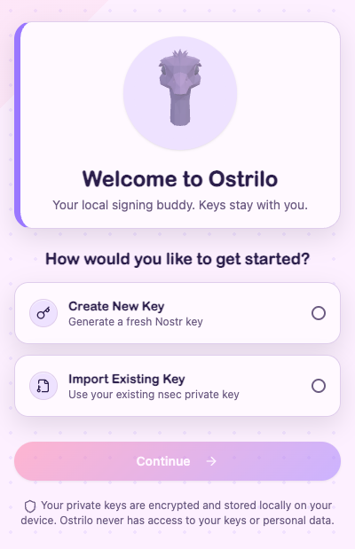

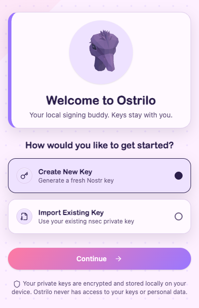

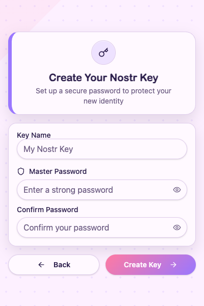

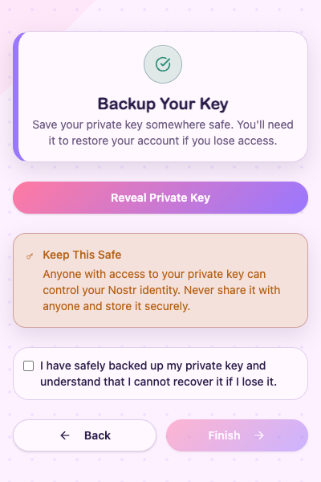

### Popup And Side Panel

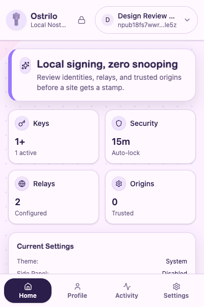

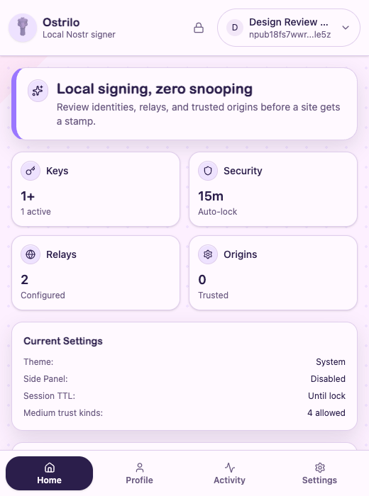

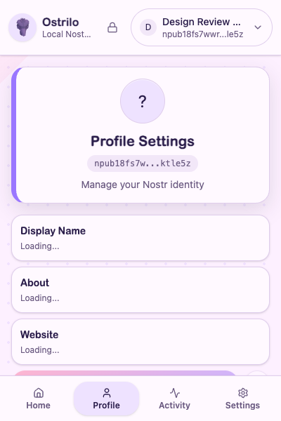

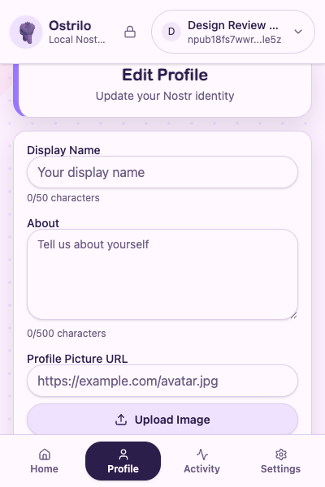

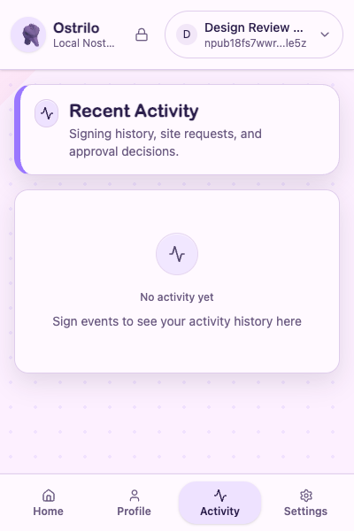

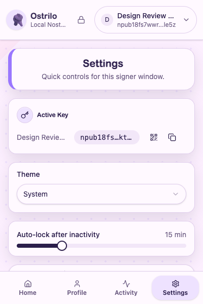

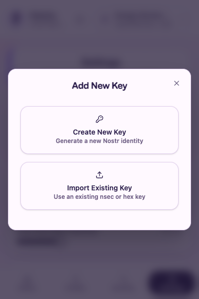

### Options

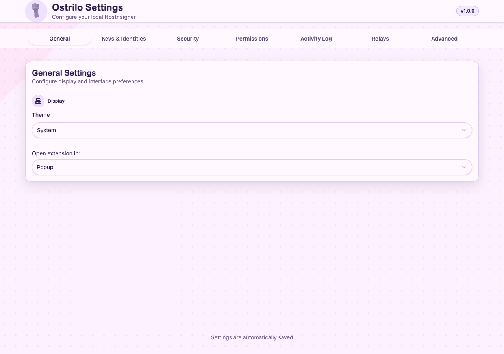

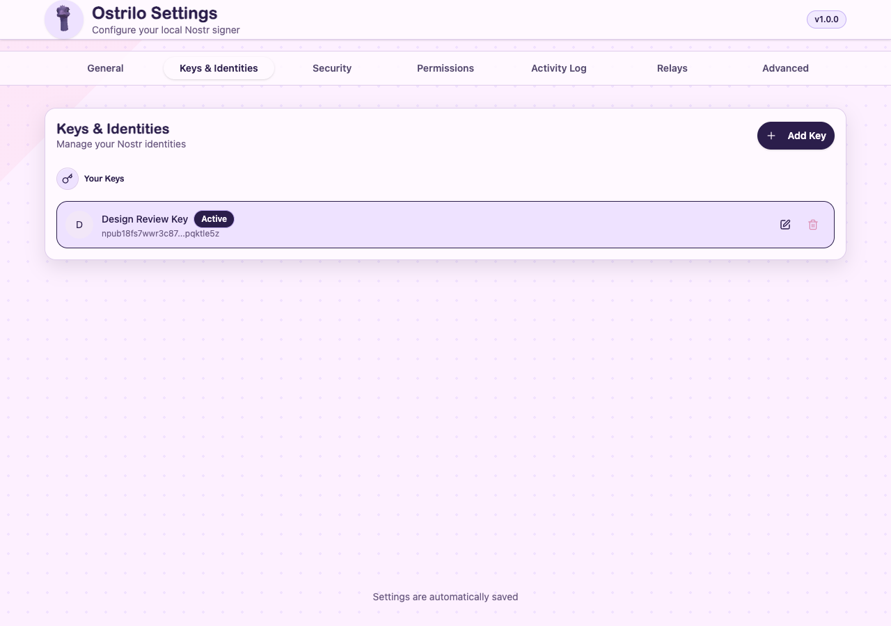

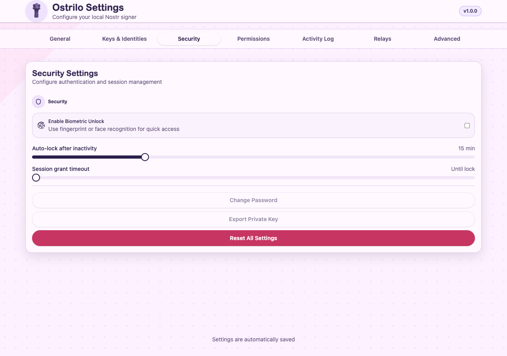

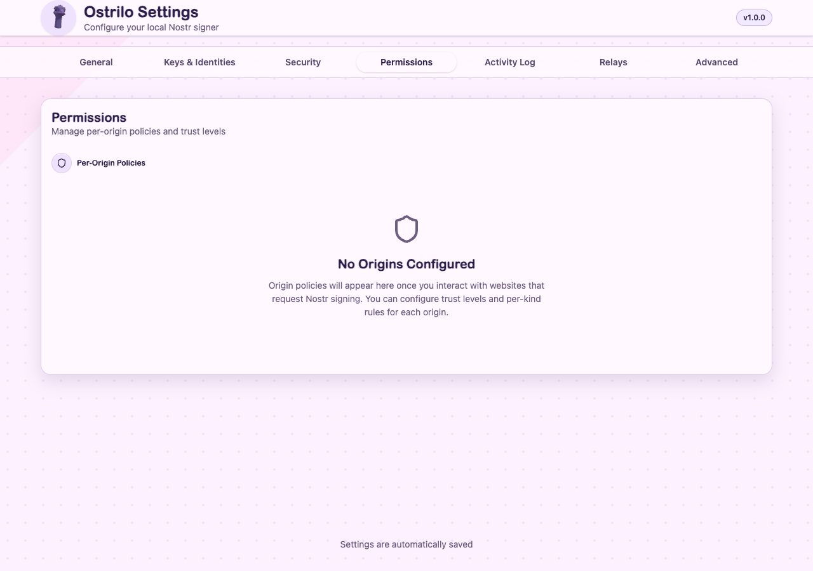

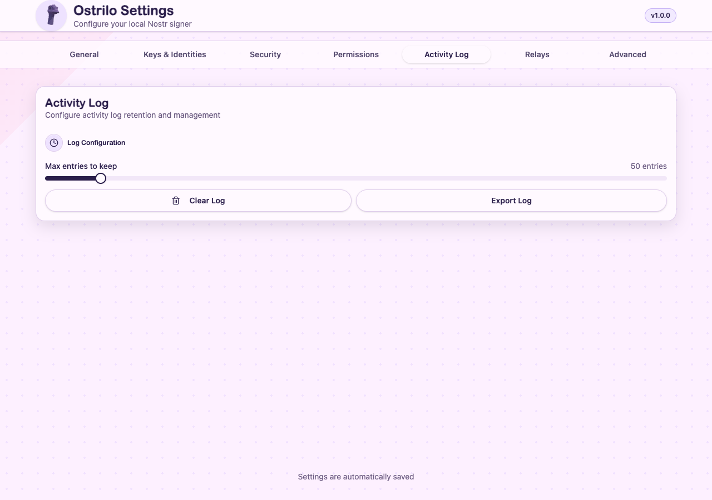

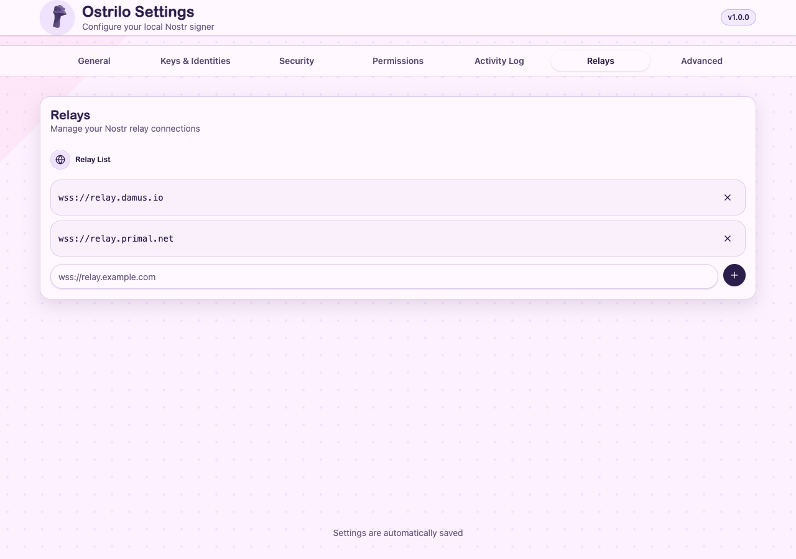

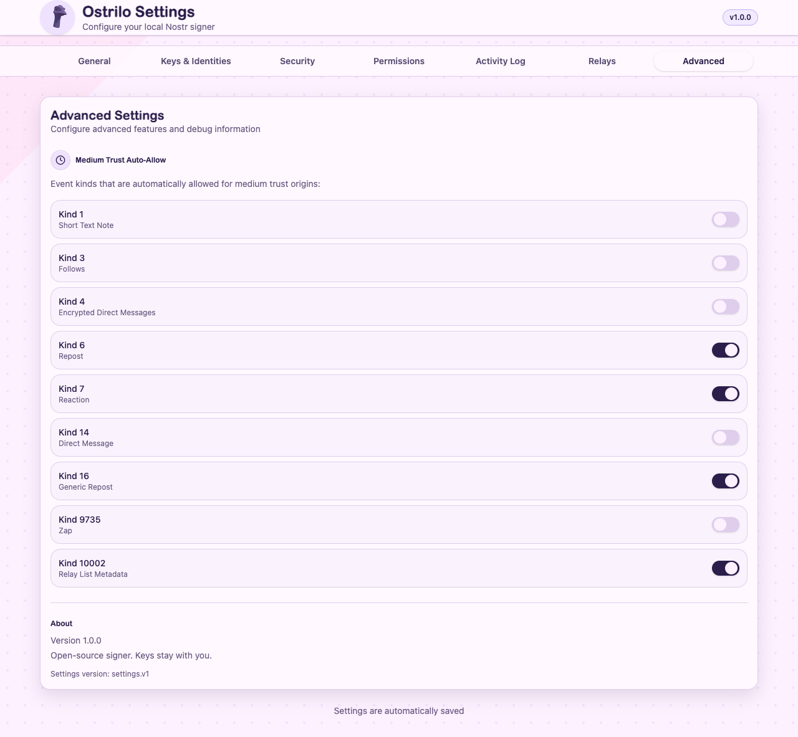

### Approval

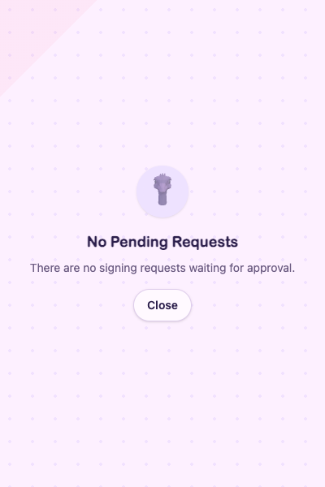

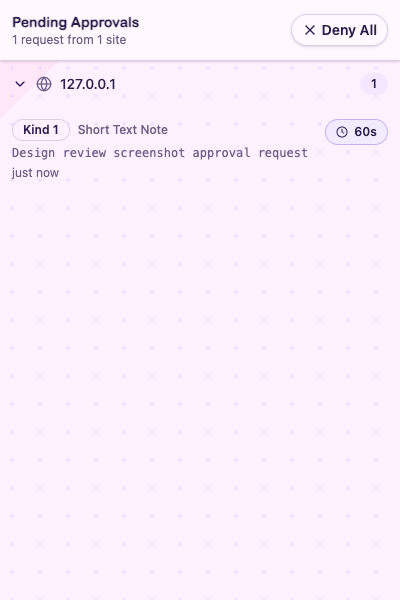

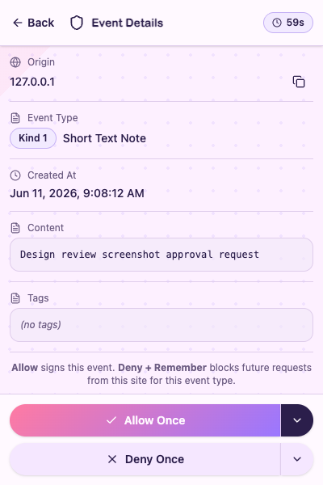

### Locked

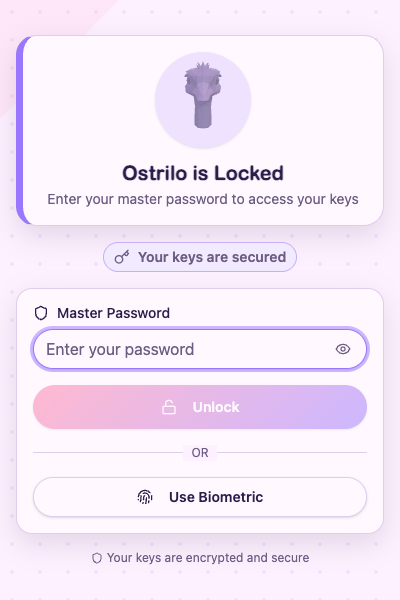
