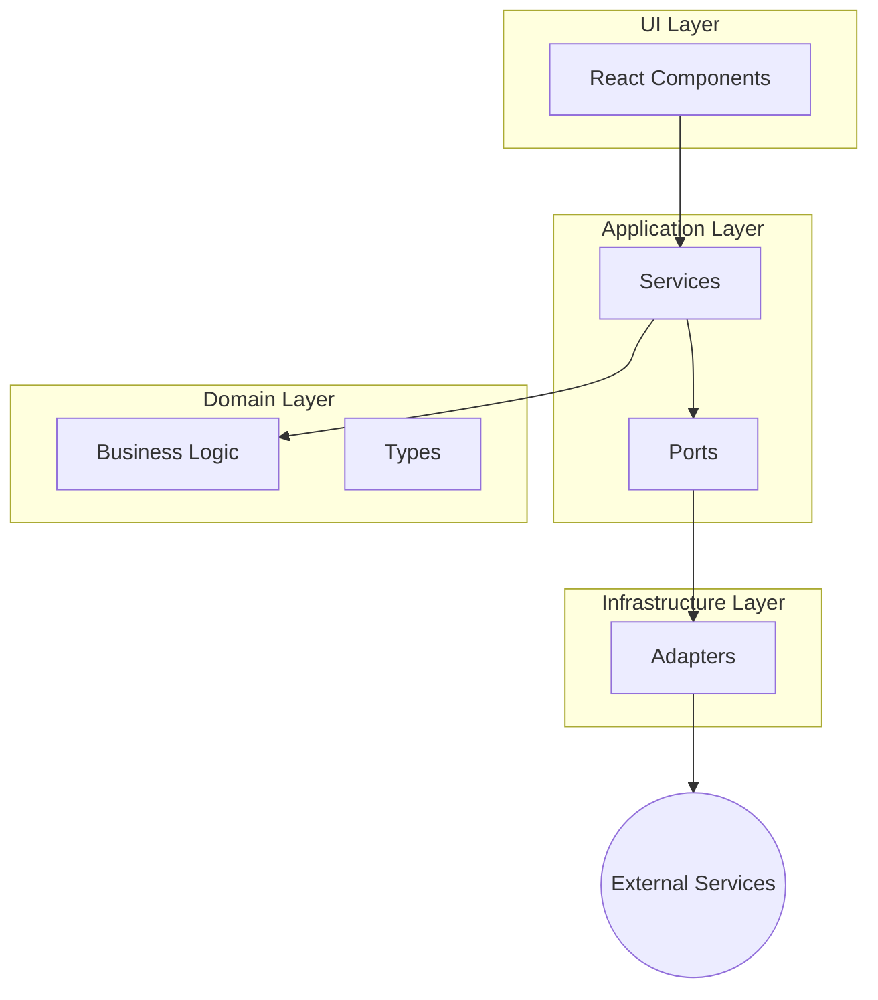

# Ostrilo Developer's Guide

Welcome to the Ostrilo developer's guide! This document provides a comprehensive overview of the Ostrilo Nostr Signer extension's architecture, design patterns, and codebase structure. Its purpose is to help new contributors get up to speed quickly and start contributing effectively.

## High-Level Overview

Ostrilo is a browser extension that acts as a Nostr signer. It's designed to securely manage user keys and sign Nostr events locally, without ever exposing private keys to the web. The extension is built using React, TypeScript, and WXT (a Web Extension framework).

The architecture of Ostrilo follows the principles of **Hexagonal Architecture** (also known as Ports and Adapters). This architectural style emphasizes a clear separation of concerns between the application's core logic and its external dependencies.



## Project Structure

The project is organized into the following main directories:

-   `src/`: Contains all the source code for the extension.
    -   `application/`: The core application logic, including services and ports.
    -   `domain/`: The heart of the application, containing the business logic and types.
    -   `infrastructure/`: Contains the implementation of the ports defined in the application layer.
    -   `ui/`: The user interface, built with React components.
    -   `extension/`: The entry points for the browser extension (background scripts, content scripts, popup, etc.).
-   `docs/`: Contains documentation for the project.
-   `tests/`: Contains all the tests for the project.

### `src/domain`

This directory contains the core business logic of the application. It is the most independent part of the codebase and has no dependencies on other layers.

-   `types.ts`: Defines the core data structures and types used throughout the application.
-   `crypto/`: Contains the logic for cryptographic operations.
-   `policy/`: Contains the logic for evaluating policies.
-   `utils/`: Contains utility functions that are pure and have no side effects.

### `src/application`

This layer orchestrates the flow of data and commands between the UI and the domain. It contains the application services and ports.

-   `ports/`: Defines the interfaces (ports) for external services like storage and cryptography. These ports are the only way the application layer communicates with the outside world.
-   `services/`: Contains the application services that implement the core use cases of the application. For example, the `KeyVaultService` is responsible for managing keys, and the `PolicyService` is responsible for managing policies.

### `src/infrastructure`

This layer provides the concrete implementations (adapters) for the ports defined in the application layer. This is where the application interacts with the browser's APIs, such as `chrome.storage`.

-   `crypto/`: Contains the implementation of the cryptography port.
-   `storage/`: Contains the implementation of the storage port.
-   `messaging/`: Contains the logic for communication between different parts of the extension.

### `src/ui`

This layer contains the React components that make up the user interface of the extension. It is responsible for rendering the UI and handling user input.

-   `components/`: Contains reusable UI components.
-   `features/`: Contains components that represent a specific feature of the application, such as authentication, settings, or onboarding.
-   `hooks/`: Contains custom React hooks that encapsulate complex logic.
-   `state/`: Contains the React Context providers for managing global state.

## Architectural Patterns

### Hexagonal Architecture (Ports and Adapters)

As mentioned earlier, Ostrilo uses the Hexagonal Architecture pattern. This pattern allows the application to be independent of the UI, database, and other external services.

-   **Ports:** These are interfaces that define how the application interacts with the outside world. For example, the `IStorage` port in `src/application/ports/storage.ts` defines the methods for storing and retrieving data.
-   **Adapters:** These are the concrete implementations of the ports. For example, the `LocalStorageAdapter` in `src/infrastructure/storage/adapters.ts` is an adapter that implements the `IStorage` port using the browser's `localStorage` API.

This separation of concerns makes the application more testable, maintainable, and flexible. For example, we could easily swap out the `LocalStorageAdapter` for a different storage mechanism without changing the application logic.

### Dependency Injection

The application uses a simple form of dependency injection to provide the services with their dependencies. For example, the `KeyVaultService` receives an instance of the `IStorage` and `ICrypto` ports in its constructor. This makes it easy to replace the dependencies with mocks during testing.

## State Management

The application uses a combination of React's built-in state management features and the Context API for managing state.

-   **Local State:** For component-specific state, we use the `useState` and `useReducer` hooks.
-   **Global State:** For state that needs to be shared across multiple components, we use the `useContext` hook in combination with the `createContext` function. The `KeyManagerContext` in `src/ui/state/KeyManagerContext.tsx` is a good example of this.

## UI Components

The UI is built using React and styled with Tailwind CSS. We use `shadcn/ui` for some of the basic UI components.

-   **Component Organization:** Components are organized by feature in the `src/ui/features` directory. Common, reusable components are placed in the `src/ui/components/common` directory.
-   **Styling:** We use Tailwind CSS for styling. The `tailwind.config.js` file contains the configuration for Tailwind. We also use `clsx` and `tailwind-merge` to conditionally apply classes.

## Contributing

We welcome contributions from the community! If you'd like to contribute to Ostrilo, please follow these steps:

1.  **Fork the repository.**
2.  **Create a new branch for your feature or bug fix.**
3.  **Make your changes.**
4.  **Write tests for your changes.**
5.  **Run the tests and make sure they pass.**
6.  **Submit a pull request.**

### Running the tests

To run the tests, use the following command:

```bash
npm test
```

This will run all the unit and integration tests. To run the end-to-end tests, use the following command:

```bash
npm run test:e2e
```

We hope this guide has been helpful. If you have any questions, please don't hesitate to open an issue on GitHub.
