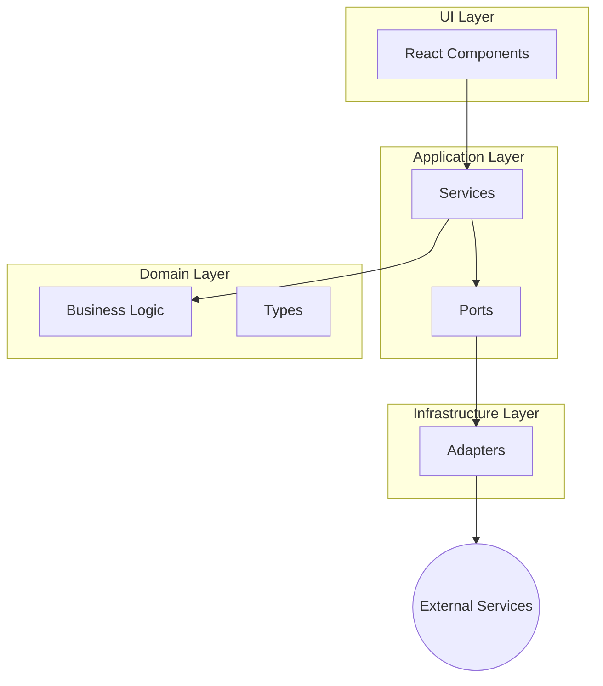

# Ostrilo Developer's Guide

Welcome to the Ostrilo developer's guide! This document provides a comprehensive overview of the Ostrilo Nostr Signer extension's architecture, design patterns, and codebase structure. Its purpose is to help new contributors get up to speed quickly and start contributing effectively.

## High-Level Overview

Ostrilo is a browser extension that acts as a Nostr signer. It's designed to securely manage user keys and sign Nostr events locally, without ever exposing private keys to the web. The extension is built using React, TypeScript, and WXT (a Web Extension framework).

The architecture of Ostrilo follows the principles of **Hexagonal Architecture** (also known as Ports and Adapters). This architectural style emphasizes a clear separation of concerns between the application's core logic and its external dependencies.



## Project Structure

The project is organized into the following main directories:

-   `src/`: Contains all the source code for the extension.
    -   `application/`: The core application logic, including services and ports.
    -   `domain/`: The heart of the application, containing the business logic and types.
    -   `infrastructure/`: Contains the implementation of the ports defined in the application layer.
    -   `ui/`: The user interface, built with React components.
    -   `extension/`: The entry points for the browser extension (background scripts, content scripts, popup, etc.).
-   `docs/`: Contains documentation for the project.
-   `tests/`: Contains all the tests for the project.

### `src/domain`

This directory contains the core business logic of the application. It is the most independent part of the codebase and has no dependencies on other layers.

-   `types.ts`: Defines the core data structures and types used throughout the application.
-   `crypto/`: Contains the logic for cryptographic operations.
-   `policy/`: Contains the logic for evaluating policies.
-   `utils/`: Contains utility functions that are pure and have no side effects.

### `src/application`

This layer orchestrates the flow of data and commands between the UI and the domain. It contains the application services and ports.

-   `ports/`: Defines the interfaces (ports) for external services like storage and cryptography. These ports are the only way the application layer communicates with the outside world.
-   `services/`: Contains the application services that implement the core use cases of the application. For example:
    -   `KeyVaultService` - Manages keys and signing operations
    -   `PolicyService` - Manages per-origin permission policies
    -   `ProfileService` - Fetches, caches, and publishes Nostr profile metadata (NIP-01 kind:0 events)
    -   `SettingsService` - Manages user settings and preferences
    -   `ActivityLogService` - Maintains activity logs with ring buffer
    -   `ApprovalQueueService` - Manages pending approval requests

### `src/infrastructure`

This layer provides the concrete implementations (adapters) for the ports defined in the application layer. This is where the application interacts with the browser's APIs, such as `chrome.storage`.

-   `crypto/`: Contains the implementation of the cryptography port.
-   `storage/`: Contains the implementation of the storage port.
-   `relay/`: Contains WebSocket-based Nostr relay adapters implementing the `INostrRelay` port:
    -   `NostrRelayAdapter` - WebSocket client for single relay connection
    -   `RelayManager` - Multi-relay manager with parallel queries and deduplication
-   `messaging/`: Contains the logic for communication between different parts of the extension.
    -   `handlers/`: Contains RPC handlers including `nostr-rpc.ts` for NIP-07 operations and `profile-rpc.ts` for profile management.

### `src/extension`

This directory contains the browser extension entry points:

-   `background.ts`: The service worker/background script that handles RPC routing and maintains vault state.
-   `content.ts`: The content script that acts as a message bridge between web pages and the background script.
-   `injected.ts`: The script injected into web pages to provide the `window.nostr` API (NIP-07).
-   `popup/`: The popup UI shown when clicking the extension icon.
-   `sidepanel/`: The side panel UI for Chrome.

### `src/ui`

This layer contains the React components that make up the user interface of the extension. It is responsible for rendering the UI and handling user input.

-   `components/`: Contains reusable UI components.
-   `features/`: Contains components that represent a specific feature of the application, such as authentication, settings, or onboarding.
-   `hooks/`: Contains custom React hooks that encapsulate complex logic.
-   `state/`: Contains the React Context providers for managing global state.

## Architectural Patterns

### Hexagonal Architecture (Ports and Adapters)

As mentioned earlier, Ostrilo uses the Hexagonal Architecture pattern. This pattern allows the application to be independent of the UI, database, and other external services.

-   **Ports:** These are interfaces that define how the application interacts with the outside world. For example, the `StoragePort` and `StorageSuite` interfaces in `src/application/ports/storage.ts` define the methods for storing and retrieving data across multiple storage areas.
-   **Adapters:** These are the concrete implementations of the ports. For example, the `createStorageSuite()` function in `src/infrastructure/storage/adapters.ts` is an adapter that implements the `StoragePort` and `StorageSuite` interfaces using the `webextension-polyfill` library to access `browser.storage`.

This separation of concerns makes the application more testable, maintainable, and flexible. For example, we could easily swap out the `createStorageSuite()` implementation for a different storage mechanism without changing the application logic.

### Dependency Injection

The application uses a simple form of dependency injection to provide the services with their dependencies. For example, the `KeyVaultService` receives instances of the `StorageSuite` port and individual crypto ports (`CryptoAead`, `CryptoKdf`, `Schnorr`, `CryptoHash`, `Bech32Codec`) in its constructor. This makes it easy to replace the dependencies with mocks during testing.

## State Management

The application uses a combination of React's built-in state management features and the Context API for managing state.

-   **Local State:** For component-specific state, we use the `useState` and `useReducer` hooks.
-   **Global State:** For state that needs to be shared across multiple components, we use the `useContext` hook in combination with the `createContext` function. The `KeyManagerContext` in `src/ui/state/KeyManagerContext.tsx` is a good example of this.

## NIP-07 Provider (window.nostr)

Ostrilo implements the NIP-07 standard, which provides a `window.nostr` object that web applications can use to interact with the signer.

### Architecture

The NIP-07 provider uses a three-layer communication model:

```
Web Page (window.nostr) ←→ Content Script ←→ Background Script
         injected.ts           content.ts        background.ts
```

1. **`injected.ts`**: Runs in the page's MAIN world, exposes `window.nostr` API
2. **`content.ts`**: Runs in ISOLATED world, bridges messages between page and extension
3. **`background.ts`**: Processes requests via `NostrRpcHandler`

### Supported Methods

```typescript
// Get the public key of the currently selected identity
const pubkey = await window.nostr.getPublicKey();
// Returns: "79be667ef9dcbbac55a06295ce870b07029bfcdb2dce28d959f2815b16f81798"

// Sign an unsigned Nostr event
const signedEvent = await window.nostr.signEvent({
  kind: 1,
  content: "Hello, Nostr!",
  tags: [],
  created_at: Math.floor(Date.now() / 1000),
});
// Returns: { id, pubkey, created_at, kind, tags, content, sig }
```

### Policy Evaluation

Before signing events, the `NostrRpcHandler` evaluates the requesting origin's policy:

- **allow**: Event is signed immediately
- **deny**: Request is rejected with `policy_denied` error
- **ask**: User approval required via popup (see Approval Flow below)

### Approval Flow

When a policy evaluates to "ask", Ostrilo presents a real-time approval prompt to the user. This flow is implemented through a combination of background queue management, popup UI, and RPC communication.

#### Architecture

```
dApp → Content Script → Background Script → Approval Queue → Approval Popup
                                                ↓
                                        User Decision (Allow/Deny)
                                                ↓
                                        Background Script → dApp
```

#### Components

**ApprovalQueueService** (`src/application/services/approval-queue.service.ts`)
- Manages pending approval requests in a FIFO queue
- Each request has a unique ID and 60-second timeout
- Auto-denies requests that timeout without user action
- Resolves requests when user makes a decision

**ApprovalRpcHandler** (`src/infrastructure/messaging/handlers/approval-rpc.ts`)
- Provides RPC methods for approval popup:
  - `approval.getNext`: Fetch the next pending request
  - `approval.resolve`: Submit user's decision
  - `approval.count`: Get count of pending requests

**ApprovalPrompt** (`src/ui/features/approval/components/ApprovalPrompt.tsx`)
- Displays request details: origin, event kind, content preview, signing key
- Shows countdown timer for timeout
- Provides action buttons: Allow, Allow Once, Deny, Deny + Remember

#### Request Flow

1. **dApp calls `signEvent`**: The unsigned event flows through content script to background script
2. **Policy evaluation**: `PolicyService.evaluate()` returns `{ mode: "ask" }`
3. **Queue request**: `ApprovalQueueService.enqueue()` creates a pending request with unique ID
4. **Open popup**: Background script opens approval popup via `browser.windows.create()`
   - Fallback: If popup creation fails, sets badge notification to alert user
5. **Fetch request**: Popup calls `approval.getNext` RPC to get request details
6. **Display UI**: Shows origin, event kind, content preview, and action buttons
7. **User decides**: Clicks one of four action buttons
8. **Resolve request**: Popup calls `approval.resolve` RPC with decision
9. **Update policy**: If "Allow" with remember was clicked for an unprotected kind, adds an allow rule for origin+kind. If "Deny + Remember" was clicked, adds a deny rule for origin+kind.
10. **Return result**: Promise in background script resolves/rejects, result flows back to dApp
11. **Next request**: If queue has more requests, popup shows next one; otherwise closes

#### User Actions

| Action | Behavior | Policy Change |
|--------|----------|---------------|
| **Allow** | Sign event and return to dApp | Creates allow rule for unprotected origin+kind |
| **Allow Once** | Same as Allow (alias for clarity) | None |
| **Deny** | Reject with "user_denied" error | None |
| **Deny + Remember** | Reject with "user_denied" error | Creates deny rule for origin+kind |

#### Timeout Handling

- Default timeout: 60 seconds
- Countdown timer shown in popup UI
- On timeout: Request auto-denied, popup closes
- dApp receives "user_denied" error

#### Cross-Browser Support

The approval popup uses `browser.windows.create()` which is supported in both Chrome and Firefox:
- Chrome MV3: Opens as popup window
- Firefox MV2: Opens as popup window

Fallback mechanism: If popup creation fails (e.g., blocked by browser), extension badge is set to "!" with orange background and title updated to prompt user to click extension icon.

#### Testing Approval Flow

Unit tests cover queue operations and timeout behavior:
```bash
pnpm run test:unit tests/unit/application/approval-queue.service.test.ts
```

E2E tests document expected behavior for approval scenarios:
```bash
pnpm run test:e2e tests/e2e/approval-flow.spec.ts
```

Manual testing with a Nostr web client:
1. Build extension: `pnpm run build`
2. Load extension in browser
3. Complete onboarding to create/import a key
4. Visit a Nostr web app (e.g., nostrudel.ninja, snort.social)
5. Set policy for the origin to "ask" via Settings → Permissions
6. Trigger a signing request in the web app
7. Verify approval popup appears with correct details
8. Test each action button and verify behavior

### Message Protocol

Messages between injected script and content script use `window.postMessage`:

```typescript
// Request (injected → content)
{ type: "OSTRILO_NOSTR_REQUEST", id: string, method: string, params?: unknown }

// Response (content → injected)  
{ type: "OSTRILO_NOSTR_RESPONSE", id: string, result?: unknown, error?: string }
```

### Testing NIP-07

You can test the NIP-07 provider in the browser console on any page:

```javascript
// Check if provider is available
console.log(window.nostr);

// Get public key (requires unlocked vault)
await window.nostr.getPublicKey();

// Sign an event
await window.nostr.signEvent({
  kind: 1,
  content: "Test note",
  tags: [],
  created_at: Math.floor(Date.now() / 1000),
});
```

## Profile Metadata Management

Ostrilo includes comprehensive profile metadata management that implements NIP-01 kind:0 events for Nostr profiles.

### ProfileService API

The `ProfileService` manages fetching, caching, and publishing Nostr profile metadata for user identities.

#### Key Methods

```typescript
// Fetch profile for a specific public key (cache-first)
async getProfile(pubkey: string, forceFetch = false): Promise<ProfileMetadata | null>

// Get all profiles for managed keys
async getAllProfiles(): Promise<Map<string, ProfileMetadata>>

// Update and publish profile for current selected key
async updateProfile(metadata: ProfileMetadata): Promise<void>

// Clear cached profile(s)
async clearCache(pubkey?: string): Promise<void>
```

#### ProfileMetadata Type

Per NIP-01 specification, all fields are optional:

```typescript
interface ProfileMetadata {
  name?: string;           // Display name (max 50 chars)
  display_name?: string;   // Alternative display name
  about?: string;          // Bio/description (max 500 chars)
  picture?: string;        // Avatar URL
  banner?: string;         // Header image URL
  website?: string;        // Personal website
  nip05?: string;          // NIP-05 identifier (user@domain.com)
  lud16?: string;          // Lightning address
}
```

### Multi-Relay Architecture

ProfileService uses a multi-relay strategy for reliability:

- **Default Relays:** `wss://relay.primal.net`
- **Query Strategy:** Parallel queries to all configured relays
- **Deduplication:** Events deduplicated by ID across relays
- **Event Selection:** Highest `created_at` timestamp wins
- **Publish Strategy:** Publishes to all relays (succeeds if ≥1 accepts)

### Caching Strategy

Profiles are cached locally for performance:

- **TTL:** 3600 seconds (1 hour) default
- **Cache Size:** Max 50 profiles with LRU eviction
- **Storage Key:** `profileCache` (Record<pubkey, ProfileCacheEntry>)
- **Cache Behavior:**
  - Zero relay queries for cached, non-expired profiles
  - Automatic refresh on cache miss or expiration
  - Manual refresh via `forceFetch` parameter

### UI Integration

The ProfileView component (`src/ui/features/profile/components/ProfileView.tsx`) provides:

- **Display Mode:** Shows profile fields with fallbacks for missing data
- **Edit Mode:** Form with validation for all NIP-01 fields
- **Image Upload:** Upload profile pictures to nostr.build
- **Loading States:** Spinner during fetch, error states with retry
- **Multi-Identity:** Displays profile for currently selected key

### Testing Profile Management

```javascript
// Test profile fetching in browser console
import { rpcClient } from '@/infrastructure/messaging/client';

// Get profile for current key
const profile = await rpcClient.send('profile.get', { pubkey: '<pubkey>' });

// Update profile
await rpcClient.send('profile.update', {
  metadata: { name: 'Alice', about: 'Nostr enthusiast' }
});

// Clear cache and force refresh
await rpcClient.send('profile.clearCache', {});
```

### Security Considerations

- **Private key isolation:** Signing happens in KeyVaultService, private keys never exposed
- **URL sanitization:** All URLs validated with Zod schemas before rendering
- **XSS prevention:** React auto-escaping, no `dangerouslySetInnerHTML`
- **Untrusted content:** Profile data treated as user input, validated and sanitized

## UI Components

The UI is built using React and styled with Tailwind CSS. We use `shadcn/ui` for some of the basic UI components.

-   **Component Organization:** Components are organized by feature in the `src/ui/features` directory. Common, reusable components are placed in the `src/ui/components/common` directory.
-   **Styling:** Tailwind CSS v4, configured in CSS rather than a JavaScript config file: `src/assets/tailwind.css` holds the theme tokens. `clsx` and `tailwind-merge` apply classes conditionally. `docs/design/DESIGN_RULES.md` governs what the styles may be.

## Contributing

See [CONTRIBUTING.md](../CONTRIBUTING.md) for setup, the blocking verification
gate and the OpenSpec workflow, and [TESTING.md](TESTING.md) for the test
suites.
